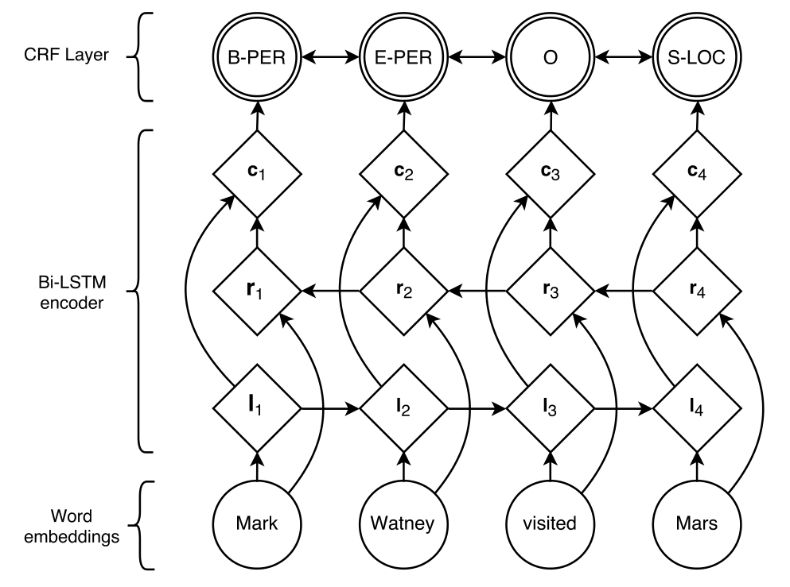
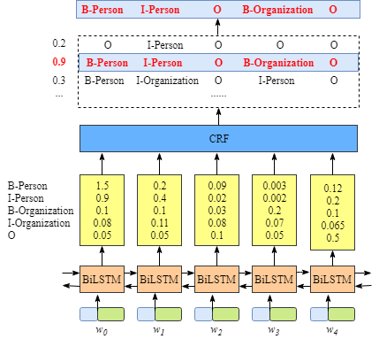
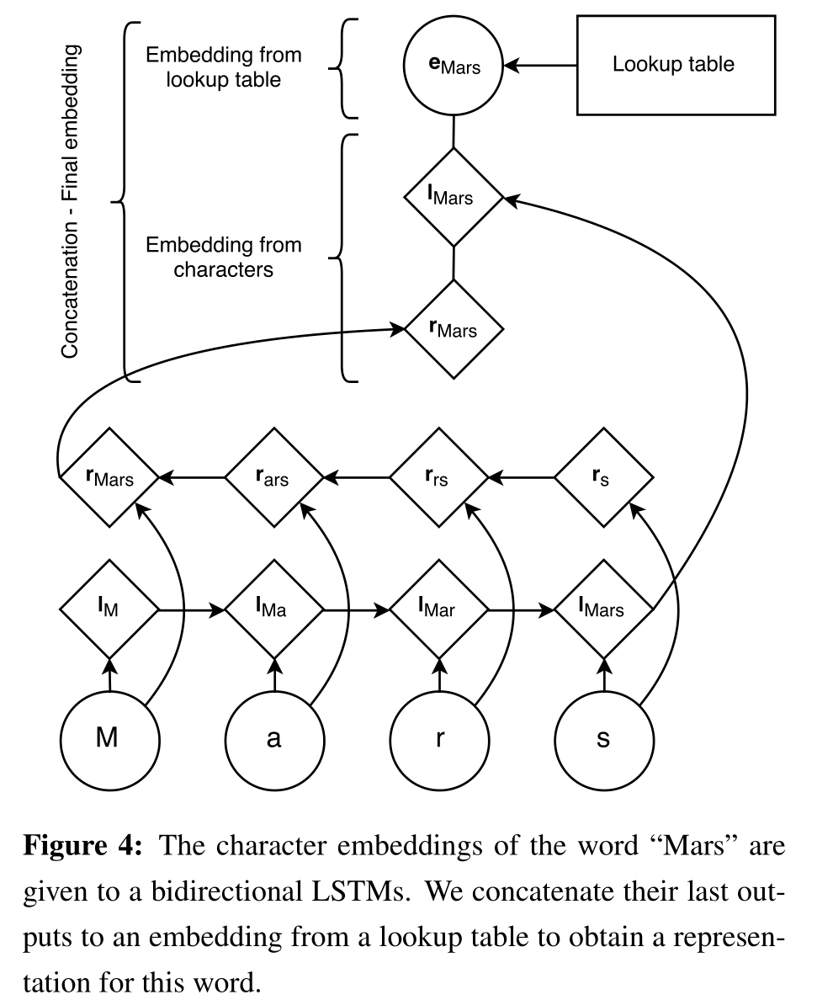
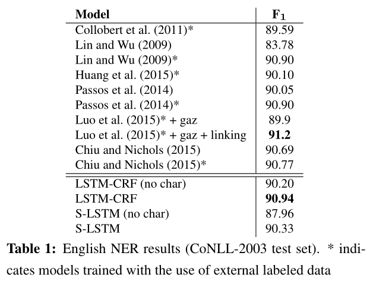

# 【NLP Papers】NER：BiLSTM-CRF

# Neural Architectures for Named Entity Recognition
[Lample et. al., 2016]

## 摘要
NER之前的SOTA：大量手工特征、领域知识，泛化能力差

介绍了两种模型：
1. BiLSTM-CRF
2. Stack-LSTM：类似移进-规约的 transition-based 方法

word representations：
1. character-based learned from supervised corpus
2. word level learned from unannotated corpora

实验结果：BiLSTM-CRF和S-LSTM（表现稍逊）在四种语言（English, Dutch, German, and Spanish）的NER上SOTA

## 1. Introduction
model旨在捕捉两种信息：
1. 多个字符组合：
	a. BiLSTM-CRF
	b. S-LSTM
2. "being a name"的特征
	a. orthographic evidence：属于name的word的特征
		- chat-based word representations
	b. distributional evidence: name在句子中位置
		- distributional representations
	- 结合两种表示，并使用了dropout防止过度依赖其中一种。

## 2. LSTM-CRF Model
### 2.1 LSTM

$$
\begin{aligned}
\mathbf{i}\_{t}=& \sigma\left(\mathbf{W}\_{x i} \mathbf{x}\_{t}+\mathbf{W}\_{h i} \mathbf{h}\_{t-1}+\mathbf{W}\_{c i} \mathbf{c}\_{t-1}+\mathbf{b}\_{i}\right) \\\\
\mathbf{c}\_{t}=&\left(1-\mathbf{i}\_{t}\right) \odot \mathbf{c}\_{t-1}+\\
& \mathbf{i}\_{t} \odot \tanh \left(\mathbf{W}\_{x c} \mathbf{x}\_{t}+\mathbf{W}\_{h c} \mathbf{h}\_{t-1}+\mathbf{b}\_{c}\right) \\\\
\mathbf{o}\_{t}=& \sigma\left(\mathbf{W}\_{x o} \mathbf{x}\_{t}+\mathbf{W}\_{h o} \mathbf{h}\_{t-1}+\mathbf{W}\_{c o} \mathbf{c}\_{t}+\mathbf{b}\_{o}\right) \\\\
\mathbf{h}\_{t}=&\mathbf{o}\_{t} \odot \tanh \left(\mathbf{c}\_{t}\right)
\end{aligned}
$$

相比于原始LSTM有两点改进：
1. peephole连接：门也依赖与上一时刻记忆单元
2. 耦合输入门和遗忘门：$\boldsymbol{f}\_{t}=1-\boldsymbol{i}\_{t}$

使用了BiLSTM

### 2.2 CRF Tagging Models
对LSTM输出的$h_t$用CRF进行jointly model

输入：
$$
\mathbf{X}=\left(\mathbf{x}\_{1}, \mathbf{x}\_{2}, \ldots, \mathbf{x}\_{n}\right)
$$

BiLSTM输出的发射分值矩阵：$\mathbf{P}$, size: $n\times k$
> k: \# of tags

假设预测tag序列为：
$$
\mathbf{y}=\left(y\_{1}, y\_{2}, \ldots, y\_{n}\right)
$$

tag转移矩阵：$\mathbf{A}$, size: $(k+2)\times (k+2)$
> $y_0, y_n$分别表示句子的 `start` 和 `end` 标签

分数定义为：
$$
s(\mathbf{X}, \mathbf{y})=\sum\_{i=0}^{n} A\_{y\_{i}, y\_{i+1}}+\sum\_{i=1}^{n} P\_{i, y\_{i}}
$$

softmax计算$y$的条件概率：
$$
p(\mathbf{y} \mid \mathbf{X})=\frac{e^{s(\mathbf{X}, \mathbf{y})}}{\sum\_{\widetilde{\mathbf{y}} \in \mathbf{Y}\_{\mathbf{X}}} e^{s(\mathbf{X}, \widetilde{\mathbf{y}})}}
$$

训练优化正确tag序列的log-probability：
$$
\begin{aligned}
\log (p(\mathbf{y} \mid \mathbf{X})) &=s(\mathbf{X}, \mathbf{y})-\log \left(\sum\_{\tilde{\mathbf{y}} \in \mathbf{Y}\_{\mathbf{X}}} e^{s(\mathbf{X}, \widetilde{\mathbf{y}})}\right) \\\\
&=s(\mathbf{X}, \mathbf{y})-\underset{\widetilde{\mathbf{y}} \in \mathbf{Y}\_{\mathbf{X}}}{\operatorname{logadd}} s(\mathbf{X}, \widetilde{\mathbf{y}})
\end{aligned}
$$

其中，$\mathbf{Y_X}$表示所有可能tag序列。

预测：
$$
\mathbf{y}^{*}=\underset{\tilde{\mathbf{y}} \in \mathbf{Y}\_{\mathbf{X}}}{\operatorname{argmax}} s(\mathbf{X}, \widetilde{\mathbf{y}})
$$

## 2.3 Parameterization and Training
网络的主要结构：

BiLSRM的输出是每个词的各个词性的评分，即发射分值矩阵$\mathbf{P}$，由BiLSTM 得到的（word-in-context词向量$c_i$）与 二元语法的转移评分计算（$\mathbf{A}\_{y,y'}$) 计算 ？

将$c_i$线性映射到每个标签上，从而得到得分。

参数：
- bigram compatibility scores $\mathbf{A}$
- matrix $\mathbf{P}$
- BiLSTM参数
- linear feature weights ?
- word embeddings

$c_i$与CRF层之间加入一个隐层，效果略好。

## 2.4 Tagging Schemes
没有使用IOB格式（Inside, Outside, Beginning)：I-label, O-label, B-label。

使用IOBES：singleton entities（S）、End（E）

## 3. Transition-Based Chunking Model
略。

## 4. Input Word Embeddings
- Char-level representattion：对单词拼写(morphologically)敏感
- Pretrained embeddings(skip-n-gram)：对词顺序敏感

### 4.1 Character-based models of words

如上图，每个单词的embeddings由三组embedding拼接：
1. char-level（表征suffix）: forward LSTM
2. char-level（表征prefix）: backward LSTM
3. word-level: lookup table

测试遇到 `UNK` 的处理：以0.5概率替换singletons，训练得到 `UNK` 的embedding

> 为什么LSTM比CNN能更好地建模word和char关系？
> - CNN捕捉位置无关信息（共享权重），而word的信息与char所在位置有关（如前后缀和词干stems编码了不同信息）

### 4.2 Pretrained embeddings
用预训练词向量初始化lookup table

预训练词向量采用 skip-n-gram (Ling et al., 2015a)：考虑了词顺序的 skip-gram (Mikolov et al., 2013a) 

### 4.3 Dropout training
use dropout  (Hinton et al., 2012) to encourage the model to depend on both representations (significant improment).

## 5. Experiments
### 5.1 Training
SGD with gradient clipping better than Adadelta/Adam :)

### 5.2 Data Sets
CoNLL-2002 and CoNLL-2003 datasets

预处理：英文NER中替换所有数字为0

### 5.3 Results

BiLSTM-CRF 在CoNLL 2003 (English) 上的 F1 达到 90.94，在未使用额外语料的模型中达到SOTA

## 总结
1. 首次将BiLSTM-CRF用于序列标注是 `Bidirectional LSTM-CRF Models for Sequence Tagging` [Huang et. al., 2015]，而本文最大特点是在 pre-trained word embedding（skip-n-gram）的基础上结合了character-based word embeddings，通过引入字符级特征提高了模型在NER任务中的表现；
2. CRF考虑了序列标注中全局范围内转移概率；
3. Dropout可以用于平衡多种特征比例。

论文描述不确切地方：2.3 `...adding a hidden
layer between ci and the CRF layer...`，应该是指在 `c_i` 和 `token2tag` 线性映射层之间添加一个隐层。

## References
- https://createmomo.github.io/2017/09/12/CRF_Layer_on_the_Top_of_BiLSTM_1/
