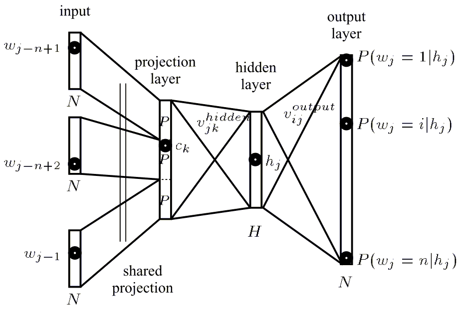

# 【NLP Papers】word2vec

# Efficient Estimation of Word Representations in Vector Space

[Mikolov 2013] original word2vec paper

> images from [The Pre-LSTM Ice-Age ](https://towardsdatascience.com/a-no-frills-guide-to-most-natural-language-processing-models-part-1-the-pre-lstm-ice-age-86055dd5d67c)

References
- https://machinelearningmedium.com/2017/07/11/word-to-vector-word-representations/
- Y. Bengio, R. Ducharme, P. Vincent. A neural probabilistic language model. Journal of Machine Learning Research, 3:1137-1155, 2003.
- T. Mikolov, M. Karafi´at, L. Burget, J. ˇCernock´y, S. Khudanpur. Recurrent neural network based language model, In: Proceedings of Interspeech, 2010.

---
## Abstract
continuous word2vec: skip-gram, CBOW
measure: word similarity task (syntactic and semantic)
SOTA!

## 1 Introduction

### 1.1 Goals of the Paper
Introduce techniques that can be used for learning high-quality wordvectors from huge data sets with billions of words, and with millions of words in the vocabulary.

### 1.2 Previous Work
- neural network language model (NNLM) 
- learn word vector with single hidden layer, then train the NNLM (this work is the extension of this architecture)

## 2 Model Architectures
representations of words
- continuous: Latent Semantic Analysis (LSA), Latent Dirichlet Allocation (LDA)
- distributed: word2vec focus on
	- 分布式与连续不互斥, 分布式表示相对的是one-hot表示。

training complexity (all the following models): $O=E \times T \times Q$ 
- E=epochs(3-50), T=words in trainning set, Q depends on model

trainning method: SGD, BP

### 2.1 Feedforward Neural Net Language Model (NNLM)
[Bengio, 2003]

3 layers:
- input: $N$ previous words (1-of-V coding, V is vovabulary size)
- projection: $D$
- hidden: $H$
- output: $V$，对于输入词，每个词是

complexity:
$$
Q=N \times D+N \times D \times H+H \times V
$$
- dominating term is $H \times V$, reduce to $H * \log \_{2}(V)$:
	- Hierarchical softmax
	- Avoiding normalized models for training
	- Binary tree representations of the vocabulary (Huffman Trees)
- dominating term becomes $N \times D \times H$

### 2.2 Recurrent Neural Net Language Model (RNNLM)
[Mikolov, 2010]

2 layers:
- input: $D=H$
- hidden: $H$ (with recurrent matrix connects itself)
- ouput: $V$

complexity:
$$
Q=H \times H+H \times V
$$

- $H \times V$ can be efficiently reduced to $H \times \log_2(V)$ by using hierarchical softmax
- Most of the complexity then comes from $H \times H$

### 2.3 Parallel Training of Neural Networks
- mini-batch asynchronous gradient descent with Adagrad

## 3 New Log-linear Models
simplify hidden layer

### 3.1 Continuous Bag-of-Words Model（CBOW）
predicts the current word based on the context

> bag-of-words: order not matter

the weight matrix between the input and the projection layer is shared for all word positions in the same way as in the NNLM

complexity:
$$
Q=N \times D+D \times \log \_{2}(V)
$$

### 3.2 Continuous Skip-gram Model（SG）
predicts surrounding words given the current word
- increase range (window size) improves quality and computational complexity
- give less weight to distant words by sampling less

complexity:
$$
Q=C \times\left(D+D \times \log \_{2}(V)\right)
$$
- C = max distance

## 4 Results
- Algebraic operations on the vector representations
	- X = vector(”biggest”)−vector(”big”)+vector(”small”)
	- search for word closest to X measured by cosine distance (answer is smallest)

### 4.1 Task Description
five types of semantic questions
nine types of syntacitic questions

### 4.2 Maximization of Accuracy
corpus: Google News

