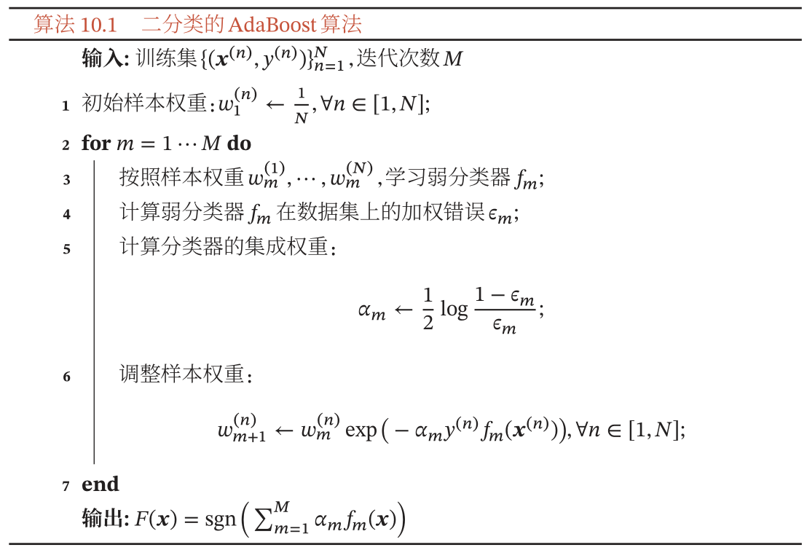
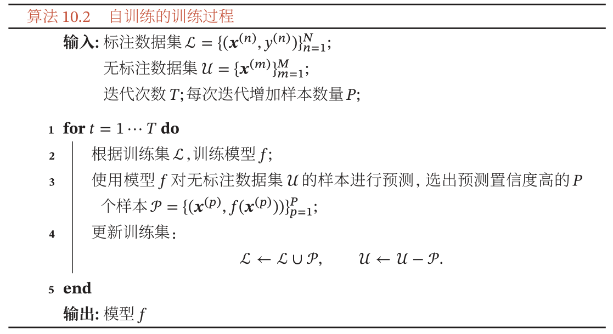
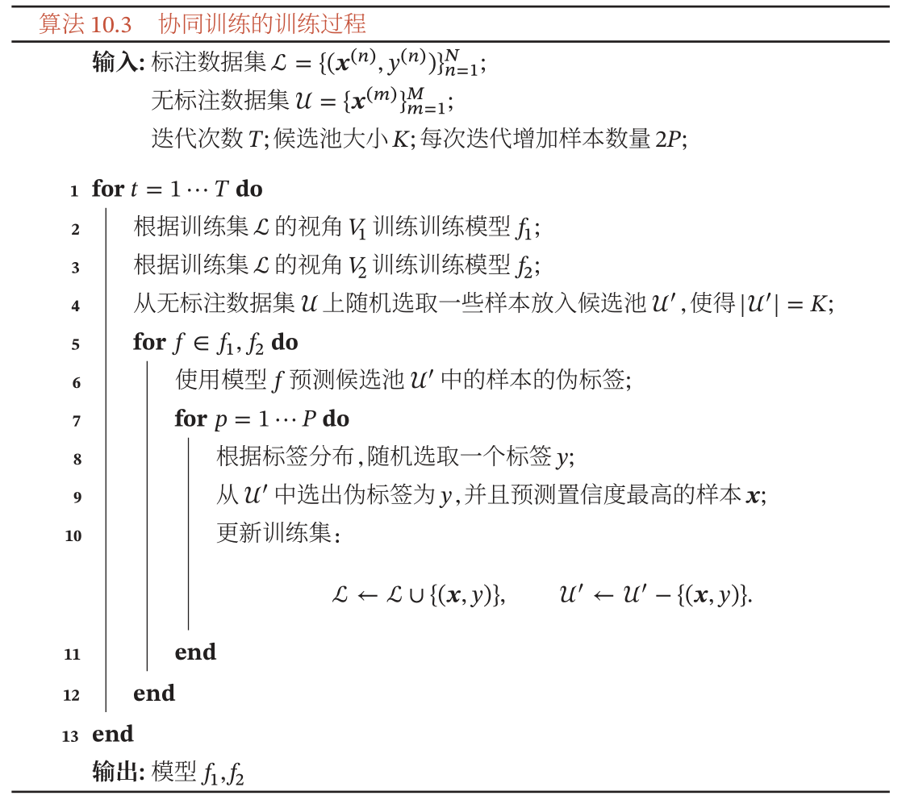
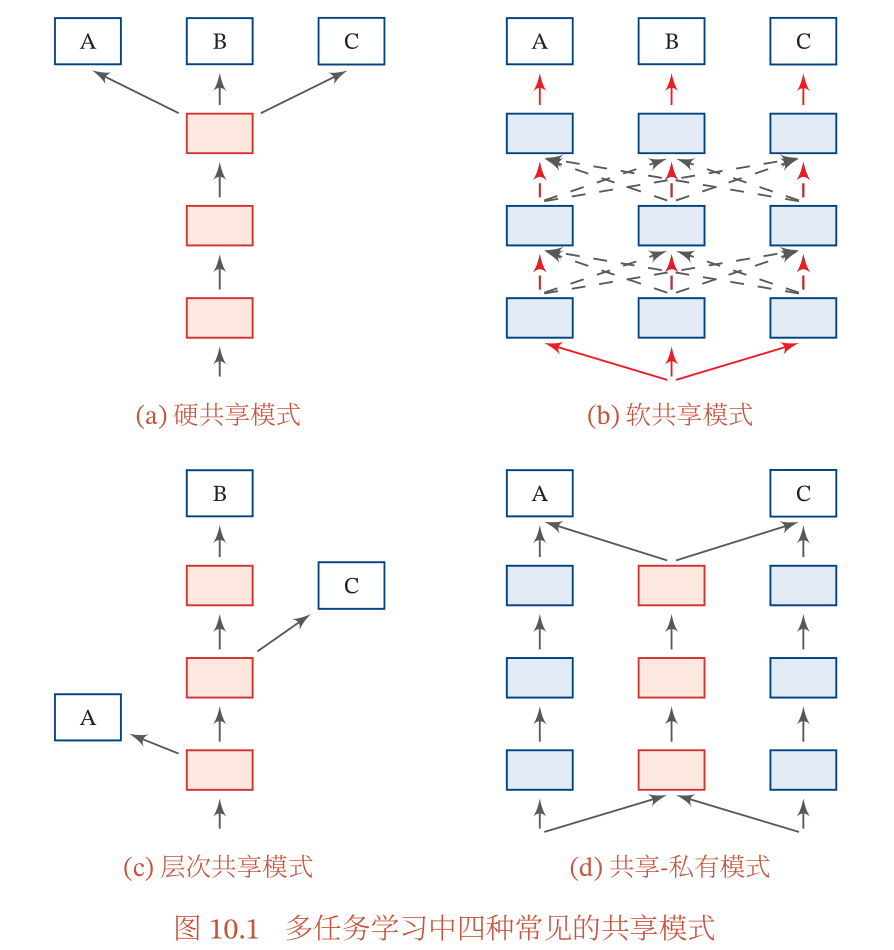
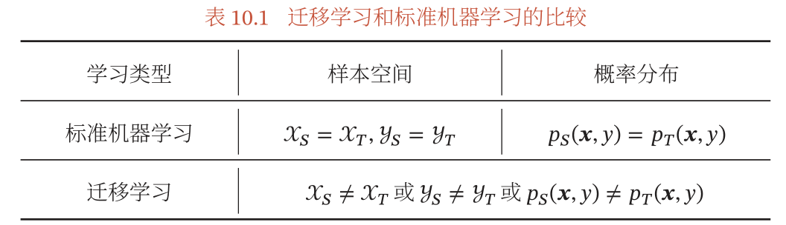
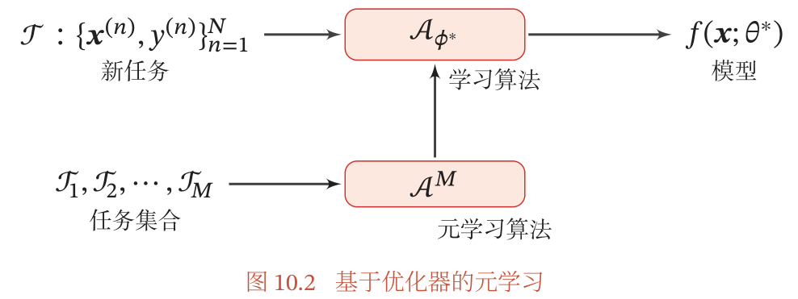
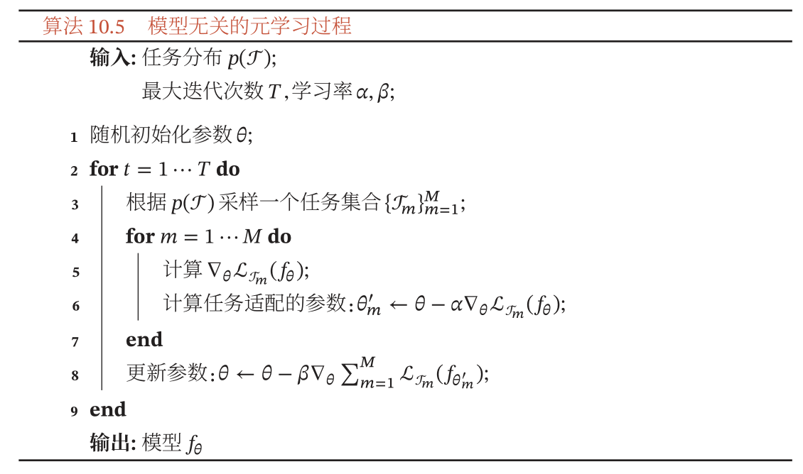

# 《神经网络与深度学习》第10章 - 模型独立的学习方式

## 10.1 集成学习
M 个模型在同一任务上的期望错误：

$$
\begin{aligned}
\mathcal{R}\left(f\_{m}\right) &=\mathbb{E}\_{\boldsymbol{x}}\left[\left(f\_{m}(\boldsymbol{x})-h(\boldsymbol{x})\right)^{2}\right] \\\\
&=\mathbb{E}\_{\boldsymbol{x}}\left[\epsilon\_{m}(\boldsymbol{x})^{2}\right]
\end{aligned}
$$

则所有模型平均错误：

$$
\overline{\mathcal{R}}(f)=\frac{1}{M} \sum\_{m=1}^{M} \mathbb{E}\_{\boldsymbol{x}}\left[\epsilon\_{m}(\boldsymbol{x})^{2}\right]
$$

集成学习（Ensemble Learning）：群体决策提高准确率。

**集成策略**

直接平均：
$$
F(\boldsymbol{x})=\frac{1}{M} \sum\_{m=1}^{M} f\_{m}(\boldsymbol{x})
$$

可以证明：
$$
\overline{\mathcal{R}}(f) \geq \mathcal{R}(F) \geq \frac{1}{M} \overline{\mathcal{R}}(f)
$$

有效的集成需要基模型的差异尽可能大：
1. Bagging 类方法
	- Bagging（Bootstrap Aggregating）：对原训练集有放回采用得到 M 个较小数据集，并训练 M 个模型
	- 随机森林（Random Forest）：在 Bagging 基础上再引入随机特征，每个基模型都是一棵决策树
2. Boosing 类方法：后面的模型对前序模型的错误进行专门训练，即根据前序模型结果增加分错训练样本权重。eg. AdaBoost

### 10.1.1 AdaBoost 方法

Boosting 类学习目标：加性模型（Additive Model），即弱分类器加权得到强分类器：

$$
F(\boldsymbol{x})=\sum\_{m=1}^{M} \alpha\_{m} f\_{m}(\boldsymbol{x})
$$

AdaBoost（Adaptive Boosting）算法：加法模型，指数损失函数，前向分步（Stage-Wise）优化的二类分类学习方法。

## 10.2 自训练和协同训练
半监督学习（Semi-Supervised Learning，SSL）：利用少量标注数据和大量无标注数据学习。

### 10.2.1 自训练
自训练（Self-Training，或 Self-Teaching）：自举法（Bootstrapping），将预测置信度高的样本及其伪标签加入训练集，然后重新训练，不断反复。

自训练与密度估计中 EM 算法相似，都是通过不断迭代提高模型能力。

自训练缺点：无法保证伪标签正确性，可能反倒损害模型能力。关键是设置挑选样本的标准。

### 10.2.2 协同训练
协同训练（Co-Training）：自训练的一种改进，两个基于不同**视角（View）**的模型相互促进。

视角：如网页分类，采用文字还是链接进行分类
1. 条件独立性：给定标签 y，两种特征条件独立，$p\left(\boldsymbol{x}\_{1}, \boldsymbol{x}\_{2} \mid y\right)=p\left(\boldsymbol{x}\_{1} \mid y\right) p\left(\boldsymbol{x}\_{2} \mid y\right)$
2. 充足和冗余性：数据充足时每个视角都可以训练出正确分类器。

协同训练步骤：训练不同视角两个模型，在无标注数据集预测并各自选取置信度较高的样本加入训练集，重新训练两个模型，不断反复。

## 10.3 多任务学习
相关任务的共享知识：表示（即特征，主要关注点）、模型参数、学习算法

多任务学习（Multi-task Learning）：学习多个任务共享知识，利用任务相关性提高各任务性能、泛化能力。

多任务学习可以看作一种归纳迁移学习（Inductive Transfer Learning）：利用包含在相关任务中的信息作为归纳偏置（Inductive Bias）来提高泛化能力

主要挑战：设计**共享机制**

学习步骤：
通常使用交替训练近似同时学习，联合目标函数为各任务目标函数加权。

学习流程：
1. 联合训练阶段
2. 单任务精调阶段（可选）

## 10.4 迁移学习
领域（Domain）：$\mathcal{D}=(\mathcal{X}, y, p(\boldsymbol{x}, y))$，输入空间、输出空间、概率分布，任意一个不同即是不同领域。从统计学习的观点来看，一个机器学习任务 𝒯 定义为在一个领域 𝒟 上的条件概率 𝑝(𝑦|𝒙) 的建模问题。

迁移学习：两个不同领域的知识迁移过程

根据迁移方式分类：
1. 归纳迁移学习（Inductive Transfer Learning）：在源领域和任务上学习出一般的规律
	- 相同输入空间、不同目标任务（概率分布)
2. 转导迁移学习（Transductive Transfer Learning）：样本到样本的迁移，直接利用源领域和目标领域的样本学习

分别对应两个机器学习范式：：归纳学习（Inductive Learning）和转导学习（Transductive Learning）
1. 归纳学习：期望风险最小（真实数据分布错误率）
2. 转导学习：给定测试集错误率最小，训练时可以利用测试集信息

### 10.4.1 归纳迁移学习
要求源领域和目标领域是相关的，并且源领域有大量的训练样本（标注或无标注）

迁移方式：
1. 特征提取：将预训练模型输出或中间隐层输出作为特征直接加入目标任务模型。
2. 精调：复用预训练模型部分组件，并精调

归纳迁移学习 vs. 多任务学习
1. 多任务学习同时学习，归纳迁移学习分阶段学习
2. 多任务学习希望提高所有任务表现，归纳迁移学习是单向迁移，希望提高目标任务性能。

### 10.4.2 转导迁移学习
转导迁移学习：从样本到样本的迁移，直接利用源领域和目标领域的样本进行迁移学习。

转导迁移学习通常假设源领域有大量的标注数据，而目标领域没有（或只有少量）标注数据，但是有大量的无标注数据．目标领域的数据在训练阶段是可见的。

常见子问题：领域适应（Domain Adaptation），相同样本空间、不同数据分布 $p\_{S}(\boldsymbol{x}, y) \neq p\_{T}(\boldsymbol{x}, y)$

1. 协变量偏移（Covariate Shift）：输入边际分布不同 $p\_{S}(\boldsymbol{x}) \neq p\_{T}(\boldsymbol{x})$
2. 概念偏移（Concept Shift）：后验分布不同 $p\_{S}(y \mid \boldsymbol{x}) \neq p\_{T}(y \mid \boldsymbol{x})$，即学习任务不同
3. 先验偏移（Prior Shift）：输出标签 y 的先验分布不同 $p\_{S}(y) \neq p\_{T}(y)$

多数领域适应问题主要关注协变量偏移，关键在于如何学习领域无关（Domain-Invariant）的表示

领域适应的目标，学习模型使得：

$$\begin{aligned} \mathcal{R}\_{T}\left(\theta\_{f}\right) &=\mathbb{E}\_{(x, y) \sim p\_{T}(\boldsymbol{x}, y)}\left[\mathcal{L}\left(f\left(\boldsymbol{x} ; \theta\_{f}\right), y\right)\right] \\\\ &=\mathbb{E}\_{(x, y) \sim p\_{S}(x, y)} \frac{p\_{T}(\boldsymbol{x}, y)}{p\_{S}(\boldsymbol{x}, y)}\left[\mathcal{L}\left(f\left(\boldsymbol{x} ; \theta\_{f}\right), y\right)\right] \\\\ &=\mathbb{E}\_{(x, y) \sim p\_{S}(\boldsymbol{x}, y)} \frac{p\_{T}(\boldsymbol{x})}{p\_{S}(\boldsymbol{x})}\left[\mathcal{L}\left(f\left(\boldsymbol{x} ; \theta\_{f}\right), y\right)\right] \end{aligned}$$

如果可以学习一个映射函数，使得映射后特征空间中源领域和目标领域的边际分布相同 $p\_{S}\left(g\left(\boldsymbol{x} ; \theta\_{g}\right)\right)=p\_{T}\left(g\left(\boldsymbol{x} ; \theta\_{g}\right)\right)$，设 $\theta_g$ 为映射函数的参数，则目标函数可以近似为：

$$
\begin{aligned}
\mathcal{R}\_{T}\left(\theta\_{f}, \theta\_{g}\right) &=\mathbb{E}\_{(\boldsymbol{x}, y) \sim p\_{S}(\boldsymbol{x}, y)}\left[\mathcal{L}\left(f\left(g\left(\boldsymbol{x} ; \theta\_{\mathrm{g}}\right) ; \theta\_{f}\right), y\right)\right]+\gamma d\_{\mathrm{g}}(S, T) \\\\
&=\mathcal{R}\_{S}\left(\theta\_{f}, \theta\_{\mathrm{g}}\right)+\gamma d\_{\mathrm{g}}(S, T),
\end{aligned}
$$

学习目标：1. 提取特征是领域无关的 2. 源领域损失最小

分布差异计算：
- MMD（Maximum Mean Discrepancy）[Gretton et al., 2007]
- CMD（Central Moment Discrepancy）[Zellinger et al., 2017] 
- 对抗学习：引入领域判别器，若无法判断则认为该特征领域无关

源和目标领域训练数据：

$$
\begin{aligned}
&\mathcal{D}\_{S}=\\{(\boldsymbol{x}\_{S}^{(n)}, y\_{S}^{(n)})\\}\_{n=1}^{N} \sim p\_{S}(\boldsymbol{x}, y) \\\\
&\mathcal{D}\_{T}=\\{\boldsymbol{x}\_{T}^{(m)}\\}\_{m=1}^{M} \sim p\_{T}(\boldsymbol{x}, y)
\end{aligned}
$$

## 10.5 终身学习
终身学习（Lifelong Learning），也叫持续学习（Continuous Learning）：像人一样持续不断学习，根据历史学习经验帮助学习新任务，并不断积累知识和经验，不会因为新任务而忘记旧知识

> 按：人也会忘记长久不再接触的知识、技能，往往需要一定时间才能重新掌握

- 终身学习 vs. 归纳迁移学习：终身学习通过前 m 个任务帮助第 m + 1 个任务的设定与归纳迁移学习类似，但终身学习关注持续学习积累。
- 终身学习 vs. 多任务学习：多任务学习同时学习多个任务，终身学习持续一个一个学习。

关键问题：避免**灾难性遗忘（Catastrophic Forgetting）**，即不忘记旧任务。

灾难性遗忘解决方法：eg. 弹性权重巩固（ElasticWeight Consolidation）方法 [Kirkpatrick et al., 2017]

给定两个任务时模型参数 $\theta$ 的后验分布为：

$$
\log p(\theta \mid \mathcal{D})=\log p(\mathcal{D} \mid \theta)+\log p(\theta)-\log p(\mathcal{D})
$$

其中 $\mathcal{D}=\mathcal{D}\_{A} \cup \mathcal{D}\_{B}$ ，根据独立同分布假设，上式可以写为：

$$
\begin{aligned}
\log p(\theta \mid \mathcal{D}) &=\underline{\log p\left(\mathcal{D}\_{A} \mid \theta\right)}+\log p\left(\mathcal{D}\_{B} \mid \theta\right)+\underline{\log p(\theta)}-\log p\left(\mathcal{D}\_{A}\right)-\log p\left(\mathcal{D}\_{B}\right) \\\\
&=\log p\left(\mathcal{D}\_{B} \mid \theta\right)+\underline{\log p\left(\theta \mid \mathcal{D}\_{A}\right)}-\log p\left(\mathcal{D}\_{B}\right)
\end{aligned}
$$

其中 $p\left(\theta \mid \mathcal{D}\_{A}\right)$ 包含所有在任务 $\mathcal{J}\_{A}$ 上学到的信息，所以顺序学习任务 $\mathcal{J}\_{B}$ 时，参数后验分布与其在任务 $\mathcal{J}\_{A}$ 上的后验分布有关。

后验分布比较难以及建模，可以近似估计：
- 假设 $p\left(\theta \mid \mathcal{D}\_{A}\right)$ 为高斯分布，期望为任务 $\mathcal{J}\_{A}$ 上学习到的参数矩阵 $\theta\_{A}^{*}$ 
- 精度矩阵（协方差矩阵的逆）用参数 $\theta$ 在数据集 $\mathcal{D}\_{A}$ 上的 Fisher 信息矩阵来近似：

$$
p\left(\theta \mid \mathcal{D}\_{A}\right)=\mathcal{N}\left(\theta\_{A}^{*}, F^{-1}\right)
$$

> 详见 [Bishop, 2007] 中第 4 章中的拉普拉斯近似。

## 10.6 元学习
元学习（Meta-Learning）：学习的学习（Learning to Learn），可以对不同任务动态调整学习方式

元学习 vs. 归纳迁移学习：元学习倾向于从不同（甚至是不相关）任务中归纳学习方法

元学习与小样本学习（Few-shot Learning）比较相关。

### 10.6.1 基于优化器的元学习
不同的优化算法的区别在于更新参数的规则不同，因此一种很自然的元学习是自动学习参数更新规则，即通过另一个神经网络建模梯度下降过程。

用函数 $g\_{t}(\cdot)$ 输入梯度预测参数的更新差值 $\Delta \theta\_{t}$，第 t 步更新规则：

$$
\theta\_{t+1}=\theta\_{t}+g\_{t}\left(\nabla \mathcal{L}\left(\theta\_{t}\right) ; \phi\right)
$$

学习优化器可以看作元学习过程，目标是找到适用不同任务的优化器，每步迭代目标是 $\mathcal{L}(\theta)$ 最小：

$$
\begin{aligned}
\mathcal{L}(\phi) &=\mathbb{E}\_{f}\left[\sum\_{t=1}^{T} w\_{t} \mathcal{L}\left(\theta\_{t}\right)\right] \\\\
\theta\_{t} &=\theta\_{t-1}+g\_{t}, \\\\
\left[g\_{t} ; \boldsymbol{h}\_{t}\right] &=\operatorname{LSTM}\left(\nabla \mathcal{L}\left(\theta\_{t-1}\right), \boldsymbol{h}\_{t-1} ; \phi\right),
\end{aligned}
$$

因为网络参数非常多，LSTM 输入输出维度非常高，可以简化采用共享 LSTM 对每个参数进行更新。

### 10.6.2 模型无关的元学习（MAML）
模型无关的元学习（Model-Agnostic Meta-Learning，MAML）[Finn et al., 2017]

假设所有任务来自同一任务空间，可以学习所有任务的通用表示，然后经过梯度下降在特定单任务上精调，模型 $f\_{\theta}$ 在新任务 $\mathcal{T}\_{m}$ 上学习到的任务适配参数：

$$
\theta\_{m}^{\prime}=\theta-\alpha \nabla\_{\theta} \mathcal{L}\_{\mathcal{T}\_{m}}\left(f\_{\theta}\right)
$$

MAML的目标是学习一个参数𝜃 使得其经过一个梯度迭代就可以在新任务上达到最好的性能，即

$$
\min \_{\theta} \sum\_{\mathcal{T}\_{m} \sim p(\mathcal{T})} \mathcal{L}\_{\mathcal{T}\_{m}}\left(f\_{\theta\_{m}^{\prime}}\right)=\min \_{\theta} \sum\_{\mathcal{T}\_{m} \sim p(\mathcal{T})} \mathcal{L}\_{\mathcal{T}\_{m}}\left(f(\underbrace{\theta-\alpha \nabla\_{\theta} \mathcal{L}\_{\mathcal{T}\_{m}}\left(f\_{\theta}\right)}\_{\theta\_{m}^{\prime}})\right) .
$$

用梯度下降在所有任务上元优化（Meta-Optimization）：
$$
\begin{aligned}
\theta & \leftarrow \theta-\beta \nabla\_{\theta} \sum\_{m=1}^{M} \mathcal{L}\_{\mathcal{T}\_{m}}\left(f\_{\theta\_{m}^{\prime}}\right) \\\\
&=\theta-\beta \sum\_{m=1}^{M} \nabla\_{\theta} \mathcal{L}\_{\mathcal{T}\_{m}}\left(f\_{\theta\_{m}}\right)\left(I-\alpha \nabla\_{\theta}^{2} \mathcal{L}\_{\mathcal{T}\_{m}}\left(f\_{\theta\_{m}}\right)\right)
\end{aligned}
$$

$\beta$ 为元学习率，$\alpha$ 较小时 MAML 近似为普通多任务学习优化方法。MAML 需要计算二阶梯度，可以用一阶方法近似。

## 习题选做

#### 习题 10-2 集成学习是否可以避免过拟合？

过拟合：模型学到了很多与任务无关的 feature，在新数据上泛化能力差。
- overfitting：high variance, low bias
- under-fitting：low variance, high bias

集成学习：
- Bagging（Bagging、Random Forest）通过投票找到共性，减少 variance（方差），避免过拟合
	- 注意：有些情况，如随机森林中树过多也会导致 overfitting
- Boosting 增加模型复杂度，降低 bias（偏差），相对容易过拟合

所以 Boosting 相比 Bagging 更容易过拟合，一般还是需要 Cross-validation 方法来验证是否过拟合。

