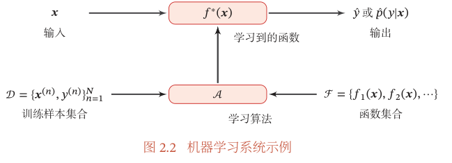
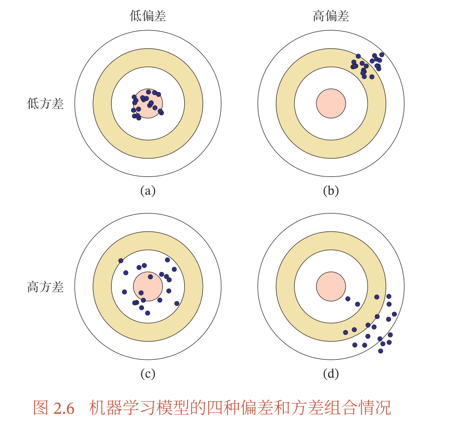
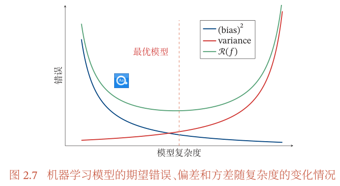
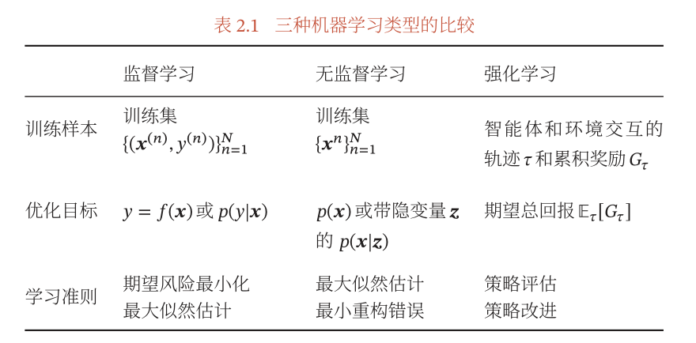
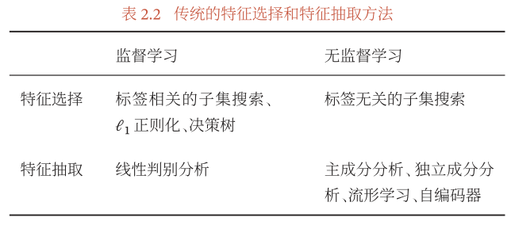
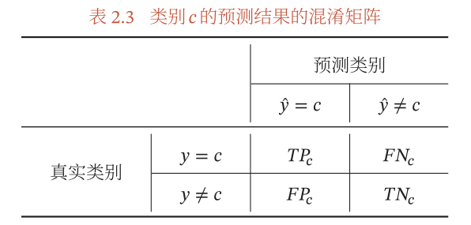
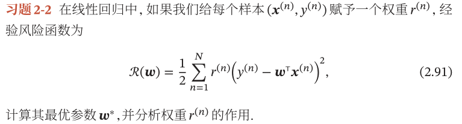

# 《神经网络与深度学习》第2章 - 机器学习概述

# 2 机器学习概述
## 2.1 基本概念

## 2.2 机器学习三要素
- 模型
	- 线性
	- 非线性
- 学习准则
	- 损失函数
	- 经验风险最小化（Empirical Risk Minimization, ERM）
		- $\mathcal{R}\_{\mathcal{D}}^{e m p}(\theta)=\frac{1}{N} \sum\_{n=1}^{N} \mathcal{L}\left(y^{(n)}, f\left(\boldsymbol{x}^{(n)} ; \theta\right)\right)$
		- $\theta^{*}=\underset{\theta}{\arg \min } \mathcal{R}\_{\mathcal{D}}^{e m p}(\theta)$
	- 结构风险最小化（Structure Risk Minimization, SRM）
		- 加入正则项，限制模型能力
- 优化算法
	- 参数和超参数
	- 梯度下降
	- 提前停止
	- BGD、SGD、mini-batch

## 2.3 示例：线性回归
- 线性模型：$f(\boldsymbol{x} ; \boldsymbol{w}, b)=\boldsymbol{w}^{\top} \boldsymbol{x}+b$
	- 增广权重和特征向量后：$f(\boldsymbol{x} ; \hat{\boldsymbol{w}})=\hat{\boldsymbol{w}}^{\top} \hat{\boldsymbol{x}}$
- 参数估计
	- 经验风险最小化
	- 结构风险最小化
	- 最大似然估计
	- 最大后验估计

### （1）经验风险最小化
经验风险：
$$\begin{aligned} \mathcal{R}(\boldsymbol{w}) &=\sum\_{n=1}^{N} \mathcal{L}\left(y^{(n)}, f\left(\boldsymbol{x}^{(n)} ; \boldsymbol{w}\right)\right) \\\\ &=\frac{1}{2} \sum\_{n=1}^{N}\left(y^{(n)}-\boldsymbol{w}^{\top} \boldsymbol{x}^{(n)}\right)^{2} \\\\ &=\frac{1}{2}\left\|\boldsymbol{y}-\boldsymbol{X}^{\top} \boldsymbol{w}\right\|^{2} \end{aligned}$$

偏导数：
$$\begin{aligned} \frac{\partial \mathcal{R}(\boldsymbol{w})}{\partial \boldsymbol{w}} &=\frac{1}{2} \frac{\partial\left\|\boldsymbol{y}-\boldsymbol{X}^{\top} \boldsymbol{w}\right\|^{2}}{\partial \boldsymbol{w}} \\\\ &=-\boldsymbol{X}\left(\boldsymbol{y}-\boldsymbol{X}^{\top} \boldsymbol{w}\right) \end{aligned}$$

令偏导数为0，求得最优参数：
$$\begin{aligned} \boldsymbol{w}^{*} &=\left(\boldsymbol{X} \boldsymbol{X}^{\mathrm{T}}\right)^{-1} \boldsymbol{X} \boldsymbol{y} \\\\ &=\left(\sum\_{n=1}^{N} \boldsymbol{x}^{(n)}\left(\boldsymbol{x}^{(n)}\right)^{\top}\right)^{-1}\left(\sum\_{n=1}^{N} \boldsymbol{x}^{(n)} y^{(n)}\right) . \end{aligned}$$

这种求解线性回归参数的方法称为**最小二乘法（Least Square Method, LSM）**

LSM要求$\boldsymbol{X X}^{\mathrm{T}} \in \mathbb{R}^{(D+1) \times(D+1)}$可逆，即满秩，即行向量线性无关，即每个特征与其他特征无关。常见的不可逆情况是样本数量N小于特征数量(D+1)，$\boldsymbol{X X}^{\mathrm{T}}$秩为N，存在多解。

$\boldsymbol{X X}^{\mathrm{T}}$不可逆解决：
1. 先用主成分分析等方法预处理数据，消除不同特征的相关性，再用最小二乘法
2. 用梯度下降法估计参数，初始化$\boldsymbol{w}=0$，迭代：
$$\boldsymbol{w} \leftarrow \boldsymbol{w}+\alpha \boldsymbol{X}\left(\boldsymbol{y}-\boldsymbol{X}^{\top} \boldsymbol{w}\right)$$
	- 也称最小均方算法（Least Mean Squares, LMS)

### （2）结构风险最小化
最小二乘法要求特征相互独立，但即使独立，如果特征之间有较大多重共线性（Multicollinearity，即其他特征线性组合预测某一特征），也会使得$\boldsymbol{X X}^{\top}$的逆数值无法准确计算。数据集X上的小扰动就会导致逆发生大的改变，结果不稳定。

解决：[Hoerl et al., 1970] 岭回归（Ridge Regression）
给$X X^{\top}$对角元素加上常数$\lambda$使得$\left(\boldsymbol{X X}^{\top}+\lambda I\right)$满秩（？），最优参数为：
$$\boldsymbol{w}^{*}=\left(\boldsymbol{X} \boldsymbol{X}^{\top}+\lambda I\right)^{-1} \boldsymbol{X} \boldsymbol{y}$$

岭回归的解$\boldsymbol{w}^*$可以看作**结构风险最小化准则**下的最小二乘估计，目标函数可以写为：
$$\mathcal{R}(\boldsymbol{w})=\frac{1}{2}\left\|\boldsymbol{y}-\boldsymbol{X}^{\top} \boldsymbol{w}\right\|^{2}+\frac{1}{2} \lambda\|\boldsymbol{w}\|^{2}$$

### （3）最大似然估计
> - 概率表达了给定$\theta$下随机变量$\mathbf{X}=\mathbf{x}$的可能性，似然表达了给定样本$\mathbf{X}=\mathbf{x}$下参数$\theta_1$（相对于参数$\theta_2$）为真实值的可能性
> - 似然函数定义：$L(\theta \mid \mathbf{x})=f(\mathbf{x} \mid \theta)$，严格记号竖线|表示条件概率/分布，分号;隔开参数，则该式子严格书写应为：$L(\theta \mid \mathbf{x})=f(\mathbf{x} ; \theta)$

y随机变量为函数加噪声：
$$y=f(\boldsymbol{x} ; \boldsymbol{w})+\epsilon=\boldsymbol{w}^{\top} \boldsymbol{x}+\epsilon$$

其中$\epsilon$服从高斯分布，则y服从高斯分布：

$$\begin{aligned} p(y \mid \boldsymbol{x} ; \boldsymbol{w}, \sigma) &=\mathcal{N}\left(y ; \boldsymbol{w}^{\top} \boldsymbol{x}, \sigma^{2}\right) \\\\ &=\frac{1}{\sqrt{2 \pi} \sigma} \exp \left(-\frac{\left(y-\boldsymbol{w}^{\top} \boldsymbol{x}\right)^{2}}{2 \sigma^{2}}\right) . \end{aligned}$$

参数$\boldsymbol{w}$在训练集上的似然函数（Likelihood）：
$$\begin{aligned} p(\boldsymbol{y} \mid \boldsymbol{X} ; \boldsymbol{w}, \sigma) &=\prod\_{n=1}^{N} p\left(y^{(n)} \mid \boldsymbol{x}^{(n)} ; \boldsymbol{w}, \sigma\right) \\\\ &=\prod\_{n=1}^{N} \mathcal{N}\left(y^{(n)} ; \boldsymbol{w}^{\top} \boldsymbol{x}^{(n)}, \sigma^{2}\right), \end{aligned}$$

方便计算取对数似然函数（Log Likelihood）：
$$\log p(\boldsymbol{y} \mid \boldsymbol{X} ; \boldsymbol{w}, \sigma)=\sum\_{n=1}^{N} \log \mathcal{N}\left(y^{(n)} ; \boldsymbol{w}^{\top} \boldsymbol{x}^{(n)}, \sigma^{2}\right)$$

最大似然估计（Maximum Likelihood Estimation，MLE）指找到参数$\boldsymbol{w}$使得似然函数最大，令偏导数为0得到：
$$\boldsymbol{w}^{M L}=\left(\boldsymbol{X} \boldsymbol{X}^{\top}\right)^{-1} \boldsymbol{X} \boldsymbol{y}$$

与最小二乘法解相同。

### （4）最大后验估计
- 为了避免最大似然估计因数据较少而过拟合，给参数分布加上先验知识（如符合各向同性高斯分布）
- 最大后验估计（Maximum A Posteriori Estimation，MAP）是指最优参数为后验分布 𝑝(𝒘|𝑿, 𝒚; 𝜈, 𝜎) 中概率密度最高的参数：
$$\boldsymbol{w}^{M A P}=\underset{\boldsymbol{w}}{\arg \max } p(\boldsymbol{y} \mid \boldsymbol{X}, \boldsymbol{w} ; \sigma) p(\boldsymbol{w} ; \nu)$$

$$\begin{aligned} \log p(\boldsymbol{w} \mid \boldsymbol{X}, \boldsymbol{y} ; \nu, \sigma) & \propto \log p(\boldsymbol{y} \mid \boldsymbol{X}, \boldsymbol{w} ; \sigma)+\log p(\boldsymbol{w} ; v) \\\\ & \propto-\frac{1}{2 \sigma^{2}} \sum\_{n=1}^{N}\left(y^{(n)}-\boldsymbol{w}^{\top} \boldsymbol{x}^{(n)}\right)^{2}-\frac{1}{2 v^{2}} \boldsymbol{w}^{\top} \boldsymbol{w} \\\\ &=-\frac{1}{2 \sigma^{2}}\left\|\boldsymbol{y}-\boldsymbol{X}^{\top} \boldsymbol{w}\right\|^{2}-\frac{1}{2 v^{2}} \boldsymbol{w}^{\top} \boldsymbol{w} \end{aligned}$$

等价于平方损失的结构风险最小化。

## 2.4 偏差-方差分解（Bias-Variance Decomposition）
$$\mathbb{E}\_{\mathcal{D}}\left[\left(f\_{\mathcal{D}}(\boldsymbol{x})-f^{\*}(\boldsymbol{x})\right)^{2}\right]$$

$$\quad=\mathbb{E}\_{\mathcal{D}}\left[\left(f\_{\mathcal{D}}(\boldsymbol{x})-\mathbb{E}\_{\mathcal{D}}\left[f\_{\mathcal{D}}(\boldsymbol{x})\right]+\mathbb{E}\_{\mathcal{D}}\left[f\_{\mathcal{D}}(\boldsymbol{x})\right]-f^{\*}(\boldsymbol{x})\right)^{2}\right]$$

$$\quad=\underbrace{\left(\mathbb{E}\_{\mathcal{D}}\left[f\_{\mathcal{D}}(\boldsymbol{x})\right]-f^{\*}(\boldsymbol{x})\right)^{2}}\_{\text {(bias.} \mathrm{x})^{2}}+\underbrace{\mathbb{E}\_{\mathcal{D}}\left[\left(f\_{\mathcal{D}}(\boldsymbol{x})-\mathbb{E}\_{\mathcal{D}}\left[f\_{\mathcal{D}}(\boldsymbol{x})\right]\right)^{2}\right]}\_{\text {variance.} \mathrm{x}},$$

## 2.5 机器学习算法的类型

## 2.6 数据的特征表示
图像特征：简单表示为$M\times N$维向量。为提高准确率，也常常加入额外特征，如直方图、宽高比、纹理特征、边缘特征等。假设总共抽取了D个特征，则这些特征可以表示为一个向量$x \in \mathbb{R}^{D}$

文本特征：
- BOW
- N-Gram

直接使用原始特征进行学习，对模型能力要求高，原始特征存在很多不足。

特征工程（Feature Engineering）：人工特征提取

特征学习（Feature Learning）/表示学习（Representation Learning）：机器自动学习有效的特征

### 2.6.1 传统的特征学习
1. 特征选择（Feature Selection）
	- 选取特征子集
	- 子集搜索：
		- 暴力：搜索全部$2^{D}$个候选子集
		- 贪心：
			- 前向搜索（Forward Search）：空集开始，每一轮加入最优特征
			- 反向搜索（Backward Search）：原始开始，每一轮删除最无用特征
	- 子集搜索方法分类：
		- 过滤式方法（Filter Method）：不依赖于具体机器学习模型，每次增加最有信息量的特征，或删除最没有信息量的特征。通过信息增益（Information Gain）衡量。
		- 包裹式方法（Wrapper Method）：使用后续机器学习模型的准确率作为评价，每次增加最有用特征，或删除最无用特征。将机器学习模型包裹到特征选择过程内部
	- $\ell\_{1}$ 正则化：也可以实现特征选择，因为$\ell\_{1}$ 正则化导致稀疏特征，间接实现了特征选择
2. 特征抽取（Feature Extraction）
	- 构造新的特征空间，将原始特征投影在新的空间中得到新的表示
	- 特征抽取分类：
		- 监督：抽取对特性任务最有用的特征，eg. 线性判别分析（Linear Discriminant Analysis，LDA）
		- 无监督：与具体任务无关，目的通常是减少冗余信息和噪声，eg. 主成分分析（Principal Component Analysis，PCA）和自编码器（Auto-Encoder，AE）

特征选择和特征抽取的优点：用较少特征表示原始特征大部分信息，去掉噪声信息，并进而调高计算效率和减小维度灾难（Curse of Dimensionality）。因为特征选择或抽取后一般特征数量会减少，也经常称为维数约减或降维（Dimension Reduction）。

### 2.6.2 深度学习方法
传统的特征抽取一般是和预测模型的学习分离的

深度学习：表示学习和预测学习有机统一，端到端。难点是如何评价表示学习对最终系统输出结果的贡献或影响，即贡献度分配问题。目前比较有效的模型是神经网络，将最后的输出层作为预测学习，其他层作为表示学习

## 2.7 评价指标
- 准确率（Accuracy）：$\mathcal{A}=\frac{1}{N} \sum\_{n=1}^{N} I\left(y^{(n)}=\hat{y}^{(n)}\right)$
- 错误率（Error Rate）：$\begin{aligned} \mathcal{E} &=1-\mathcal{A} \\\\ &=\frac{1}{N} \sum\_{n=1}^{N} I\left(y^{(n)} \neq \hat{y}^{(n)}\right) \end{aligned}$

- 精确率/精度/查准率（Precision）：$\mathcal{P}\_{c}=\frac{T P\_{c}}{T P\_{c}+F P\_{c}}$
- 召回率（Recall）/查全率：$\mathcal{R}\_{c}=\frac{T P\_{c}}{T P\_{c}+F N\_{c}}$
- F值（F Measure）：$\mathcal{F}\_{c}=\frac{\left(1+\beta^{2}\right) \times \mathcal{P}\_{c} \times \mathcal{R}\_{c}}{\beta^{2} \times \mathcal{P}\_{c}+\mathcal{R}\_{c}}$
- 宏平均（Macro Average）：**每一类**的性能指标的算术平均值
	- $\begin{aligned} \mathcal{P}\_{\text {macro }} &=\frac{1}{C} \sum\_{c=1}^{C} \mathcal{P}\_{c} \\\\ \mathcal{R}\_{\text {macro }} &=\frac{1}{C} \sum\_{c=1}^{C} \mathcal{R}\_{c} \\\\ \mathcal{F} 1\_{\text {macro }} &=\frac{2 \times \mathcal{P}\_{\text {macro }} \times R\_{\text {macro }}}{P\_{\text {macro }}+R\_{\text {macro }}} . \end{aligned}$
- 微平均（Micro Average）：**每一个样本**的性能指标的算术平均值
	- 不同类别的样本数量不均衡时，使用宏平均比微平均更合理，因为宏平均更关注小类别上的评价指标
- 在实际应用中，我们也可以通过调整分类模型的阈值来进行更全面的评价，比如 AUC（Area Under Curve）、ROC（Receiver Operating Characteristic）曲线、PR（Precision-Recall）曲线等．
- 此外，很多任务还有自己专门的评价方式，比如TopN 准确率．
- 交叉验证（Cross-Validation）：K组，轮流一组测试，其他训练，求平均

## 2.8 理论和定理
### 2.8.1 PAC 学习理论
- 计算学习理论（Computational Learning Theory）是机器学习的理论基础：分析问题难度、计算模型能力，为学习算法提供理论保证，并指导机器学习模型和学习算法的设计

- 其中最基础的理论就是**可能近似正确（Probably Approximately Correct，PAC）学习理论**．

- 泛化错误（Generalization Error）：期望错误与经验错误之间的差异，可以衡量模型是否可以很好地泛化到未知数据
$$\mathcal{G}\_{\mathcal{D}}(f)=\mathcal{R}(f)-\mathcal{R}\_{\mathcal{D}}^{e m p}(f)$$

- 根据大数定律，训练集趋于无穷大时，经验风险趋近于期望风险，泛化错误趋向于0：$\lim \_{|\mathcal{D}| \rightarrow \infty} \mathcal{R}(f)-\mathcal{R}\_{\mathcal{D}}^{e m p}(f)=0$

- PAC学习（PAC Learning）：因为不知道真实数据分布、目标函数，需要降低学习算法能力期望，只要求算法以一定概率学习到一个近似正确的假设
	1. 近似正确（Approximately Correct）：泛化错误 𝒢𝒟(𝑓) 小于一个界限 𝜖
	2. 可能（Probably）：一个学习算法𝒜 有“可能”以 1−𝛿 的概率学习到这样一个“近似正确”的假设
- PAC可学习（PAC-Learnable）的算法：该学习算法能够在多项式时间内从合理数量的训练数据中学习到一个近似正确的𝑓(𝒙)
- PAC学习的公式描述：$P\left(\left(\mathcal{R}(f)-\mathcal{R}\_{\mathcal{D}}^{e m p}(f)\right) \leq \epsilon\right) \geq 1-\delta$
	- 其中 𝜖,𝛿 是和样本数量 𝑁 以及假设空间$\mathcal{F}$相关的变量．如果固定 𝜖,𝛿，可以反过来计算出需要的样本数量：
	$$N(\epsilon, \delta) \geq \frac{1}{2 \epsilon^{2}}\left(\log |\mathcal{F}|+\log \frac{2}{\delta}\right)$$
	- 可以看到，模型越复杂，即假设空间$\mathcal{F}$越大， 模型泛化能力越差为了提高模型的泛化能力，通常需要正则化（Regularization）来限制模型复杂度．

### 2.8.2 没有免费午餐定理（No Free Lunch Theorem，NFL）
- Wolpert 和 Macerday 在最优化理论提出：对于基于迭代的最优化算法，不存在某种算法对所有问题（有限的搜索空间内）都有效
- 如果一个算法对某些问题有效，那么它一定在另外一些问题上比纯随机搜索算法更差
- 也就是说，不能脱离具体问题来谈论算法的优劣，任何算法都有局限性．必须要“具体问题具体分析”．

- 机器学习中，不存在一种机器学习算法能适合于任何领域或任务

### 2.8.3 奥卡姆剃须刀原则（Occam’s Razor）
- 如无必要，勿增实体
- 正则化思想：简单模型泛化能力好
- 性能相近模型，选择简单的
- 最小描述长度（Minimum Description Length，MDL）原则
	- 奥卡姆剃刀的一种形式化
	- 即对一个数据集 𝒟，最好的模型$f \in \mathcal{F}$会使得数据集的压缩效果最好，即编码长度最小（压缩数据长度 + 模型长度）
	- 贝叶斯学习解释：模型𝑓 在数据集𝒟 上的对数后验概率为$\begin{aligned} \max \_{f} \log p(f \mid \mathcal{D}) &=\max \_{f} \log p(\mathcal{D} \mid f)+\log p(f) \\\\ &=\min \_{f}-\log p(\mathcal{D} \mid f)-\log p(f) \end{aligned}$

### 2.8.4 丑小鸭定理（Ugly Duckling Theorem）
[Watanable, 1969]：“丑小鸭与白天鹅之间的区别和两只白天鹅之间的区别一样大”

不存在相似性的客观标准，一切相似性标注都是主观的。eg. 外观两只白天鹅更相似，基因丑小鸭与它父母的差别小于它父母与其他白天鹅的差别。

### 2.8.5 归纳偏置（Inductive Bias）
归纳偏置：学习算法对学习问题做的假设。贝叶斯学习称之为先验（Prior）

eg. 最近邻分类器中，我们会假设在特征空间中，一个小的局部区域中的大部分样本同属一类．在朴素贝叶斯分类器中，我们会假设每个特征的条件概率是互相独立的

## 习题选做
#### 习题 2-1 分析为什么平方损失函数不适用于分类问题
损失函数用于反应问题的优化程度，分类问题中的标签，没有连续概念，每个标签之间的距离也没有意义，预测值和标签之间的均分误差不能反应问题的优化程度。

最小化平方损失函数本质上等同于在误差服从高斯分布的假设下的极大似然估计，在分类问题下大部分时候误差并不服从高斯分布。

#### 2-2

$w=\left(X^{T} R X\right)^{-1}(R X)^{T} Y$
每个样本重视程度不同

#### 习题 2-11 分别用一元、二元和三元特征的词袋模型表示文本“我打了张三”和“张三打了我”，并分析不同模型的优缺点．

一元：我、打了、张三
x1 = [1,1,1]
x2 = [1,1,1]
无法表示语序

二元：$我、$张三、我打了、张三打了、打了张三、打了我、张三#、我#
$x\_{1}=[1,0,1,0,1,0,1,0]$
$x\_{2}=[0,1,0,1,0,1,0,1]$
可以表示单词间相邻顺序

三元：$我打了、$张三打了、我打了张三、张三打了我、打了张三#、打了我#
$x\_{1}=[1,0,1,0,1,0]$
$x\_{2}=[0,1,0,1,0,1]$
可以表示单词前后相邻顺序

n-gram：n为1时，无法表示顺序信息，n太大出现一个特征表示一个句子的情况，失去文本元信息
