# NNLP: A Primer on Neural Network Models for Natural Language Processing

一篇非常简洁的神经网络应用于NLP的综述（2016）。

## 1. Introduction
- purpose
	- 过去近十年: NLP通常使用线性机器学习模型（SVM、LR）在高维稀疏特征向量上训练
	- recent：神经网络（非线性）运用在稠密向量
- primer for beginners
- advanced: Deep Learning (Bengio, Goodfellow, and Courville)

### 1.1 Scope
- OUT of Scope:
	- vast literature of language modeling
	- acoustic modeling
	- neural networks for machine translation
	- multi-modal applications combining language
	- other signals such as images and videos 
	- Caching methods
	- methods for efficient training with large output vocabularies
	- attention models
	- autoencoders and recursive autoencoders
	- etc.

### 1.2 A Note on Terminology
- feature: a concrete, linguistic input such as a word, a suffix, or a part-of-speech tag
- input vector: actual input that is fed to the neural-network classifier
- input vector entry: a specific value of the input

### 1.3 Mathematical Notation
- matrices: bold upper $(\mathbf{X}, \mathbf{Y}, \mathbf{Z})$
- vectors: bold lower $(\mathbf{b})$, row vec default
	- thus, right multiplied by mat: $(\mathbf{x} \mathbf{W}+\mathbf{b})$
- series of mat/vec: superscript indices $\left(\mathbf{W}^{1}, \mathbf{W}^{2}\right)$
- exponentiated: with brackets $(\mathbf{W})^{2},\left(\mathbf{W}^{3}\right)^{2}$
- vector concatenation: $\left[\mathbf{v}\_{\mathbf{1} } ; \mathbf{v}\_{\mathbf{2} }\right]$

## 2. Neural Netword Architectures
- discuss two kinds
	- feed-forward networks
	- recurrent / recursive networks
- feed-forward networks
	- include: 
		- fully connected layers, eg. MLP
		- nn with convolutional and pooling layers
	- All of the networks act as classifiers
- Fully connected feed-forward neural networks (Section 4)
	- non-linear learners
	- 大多可以直接替代线性分类器
	- 很容易加入预训练词嵌入模型
- Networks with convolutional and pooling layers (Section 9) 
	- expect to find strong local clues regarding class membership(ie. local indicators regardless of their position)
	- promising results on many tasks...
	- facing structured data of arbitrary sizes, such as sequences and trees: can encode by sacrificing most of the structural information :(
- Recurrent and recursive architectures
	- work well with sequences and trees while preserving a lot of the structural information.
	- recurrent networks: model sequence
	- recursive networks: generalizations of recurrent networks, model trees
	- an extension of recurrent networks: model stacks

## 3. Feature Representation
- think of a feed-forward nn as function $\mathrm{NN}(\mathbf{x})$，input $d\_{in}$ vec $\mathbf{x}$，output $d\_{out}$ vec.
- the input $\mathbf{x}$ encodes features such as words, part-of-speech tags or other linguistic information
- each core feature is *embedded* as a vector into a $d$ dimensional space
- embeddings: the vector representation of each core feature, can be trained like the other parameter
- general structure for NLP classification system based on a feed-forward NN:
	1. Extract core features $f\_{1}, \ldots, f\_{k}$
	2. $f_i \rightarrow v(f_i)$
		- Different feature types may be embedded into different spaces. 
	3. $v(f_1), \ldots, v(f_k) \rightarrow \mathbf{x}$ 	
		- by concatenation, summation or a combination of both
	4. Feed $\mathbf{x}$ to NN

### 3.1 Dense Vectors vs. One-Hot Representations
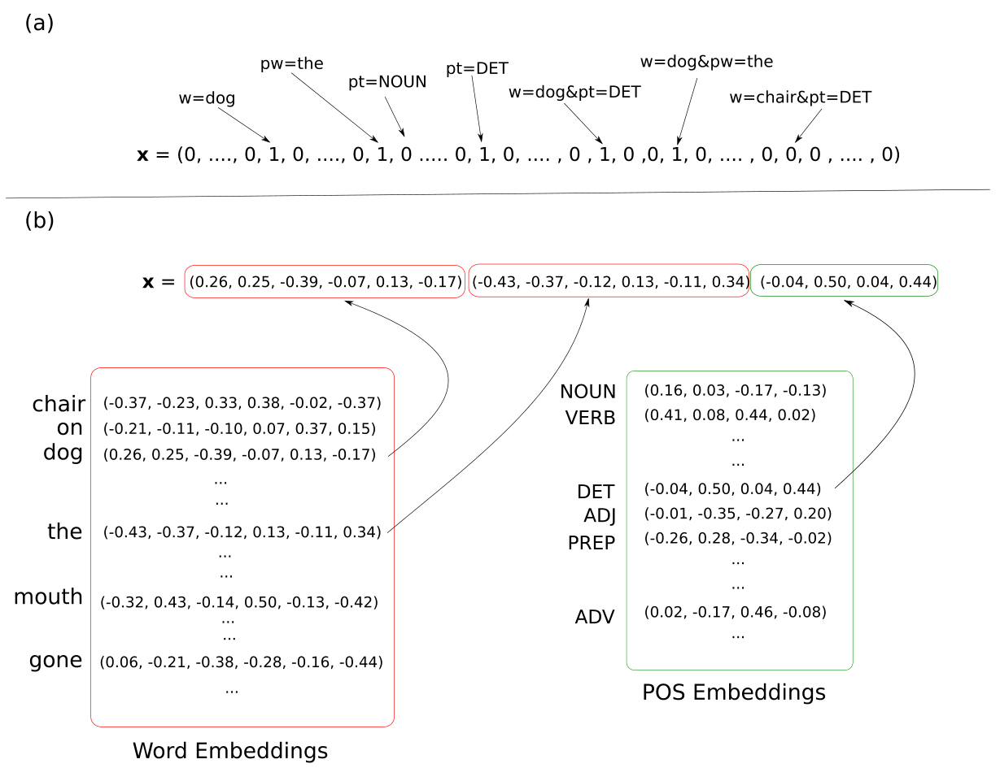
- One Hot:
	- Each feature is its own dimension.
	- Dimensionality of one-hot vector is same as number of distinct features.
	- Features are completely independent from one another. 
- Dense:
	- Each feature is a d-dimensional vector.
	- Dimensionality of vector is $d$.
	- Model training will cause similar features to have similar vectors – information is shared between similar features.
- Benifit of Dense:
	- generalization power
	- share statistical strength between similar features
- 如果特征比较少而训练数据大、特征相互没有联系，或者不希望不同特征共享统计信息，可以采用简单的one-hot。而大多数论文主张对所有特征采用稠密、可以训练的特征向量
- 使用one-hot和dense表示在NN最终结果上差异不大，使用one-hot输入总是会使得first layer学习dense的嵌入表示

### 3.2 Variable Number of Features: Continuous Bag of Words
- continuous bag of words (CBOW) : represent an unbounded number of features using a fixed size vector
$$\operatorname{CBOW}\left(f\_{1}, \ldots, f\_{k}\right)=\frac{1}{k} \sum\_{i=1}^{k} v\left(f\_{i}\right)$$
- weighted CBOW:
$$\operatorname{WCBOW}\left(f\_{1}, \ldots, f\_{k}\right)=\frac{1}{\sum\_{i=1}^{k} a\_{i} } \sum\_{i=1}^{k} a\_{i} v\left(f\_{i}\right)$$
- eg. document classification: $f_i$ may correspond to a word, associated weight $a_i$ counld be the word's TF-IDF score.
- if $v(f_i)$ were one-hot, CBOW and WCBOW become traditional(weighted) bag-of-words.

### 3.3 Distance and Position Features
- distance features are encoded similarily to the other feature types (?)

### 3.4 Feature Combinations
- combination features are crucial in linear models, 因为提供了更多维度以线性区分
	- feature designer's dirty work :(
- non-linear neural network only needs the core features
	- network will find feature combinations
	- complexity scales linearly with network size
- Kernel methods, in particulr polynomial kernels also allow only core features
	- vs. NN, kernel methods are convex, admiting exact solutions
	- high complexity, which scales linearly with data size, too slow for practice and large datasets.

### 3.5 Dimensionality
- How many dimensions should we allocate for each feature? 
	- no theoretical bounds or even best-practices
	- In current research, the dimensionality of word-embedding vectors range between about 50 to a few hundreds, and, in some extreme cases, thousands.
	- experiment and trade-off between speed and accuracy

### 3.6 Vector Sharing
- Should the vector for “dog:previous-word” be the same as the vector of “dog:next-word”? 
	- empirical question

### 3.7 Network's Output
- scalar scores to items in a discrete set, same as traditional linear models
- there is $d \times k$ matrix associated with the output layer, 列是每一类的嵌入表示，列向量的相似度代表类相似度

### 3.8 Historical Node
- dense word vector for NN: Bengio et al. (2003) 
- introduced to NLP:  Collobert, Weston and colleagues (2008, 2011)
- embeddings for represent not only words but arbitrary features: Chen and Manning (2014)

## 4. Feed-Forward Neural Networks

### 4.1 A Brain-Inspired Metaphor
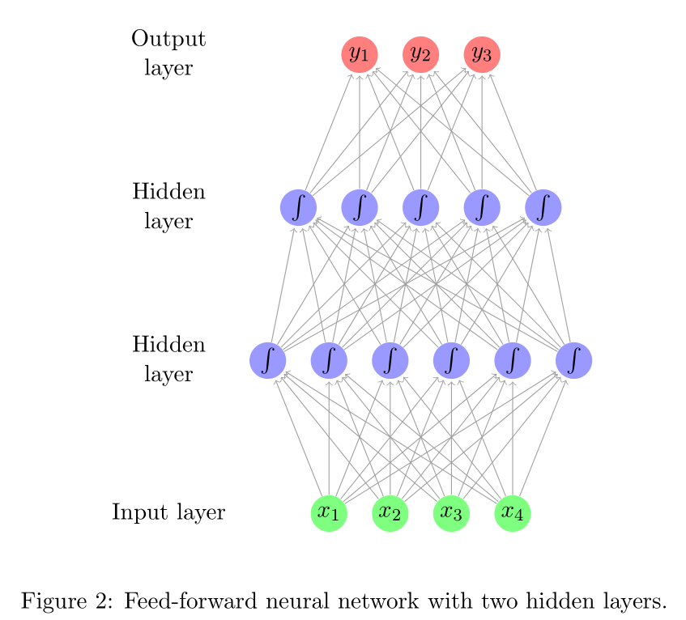
- sigmoid shape: non-linear function
- fully-connected layer / affine layer: each neuron is connected to all neurons in the next layer
- each row -> a vector
- $\mathbf{y}=\left(g\left(\mathbf{x} \mathbf{W}^{\mathbf{1} }\right)\right) \mathbf{W}^{\mathbf{2} }$

### 4.2 In Mathematical Notation
- perceptron: linear function of input

	$$\text { NN }\_{\text {Perceptron } }(\mathbf{x})=\mathbf{x} \mathbf{W}+\mathbf{b} $$

	$$ \mathbf{x} \in \mathbb{R}^{d\_{\text {in } }}, \mathbf{W} \in \mathbb{R}^{d\_{\text {in } } \times d\_{\text {out } }}, \quad \mathbf{b} \in \mathbb{R}^{d\_{\text {out } }}$$

- Multi Layer Perceptron with one hidden-layer (MLP1)

	$$\mathrm{NN}\_{\mathrm{MLP} 1}(\mathrm{x})=g\left(\mathrm{x} \mathbf{W}^{1}+\mathrm{b}^{1}\right) \mathbf{W}^{2}+\mathbf{b}^{2}$$
	
	$$\mathbf{x} \in \mathbb{R}^{d\_{\text {in } }}, \quad \mathbf{W}^{1} \in \mathbb{R}^{d\_{\text {in } } \times d\_{1} }, \quad \mathbf{b}^{\mathbf{1} } \in \mathbb{R}^{d\_{1} }, \quad \mathbf{W}^{2} \in \mathbb{R}^{d\_{1} \times d\_{2} }, \quad \mathbf{b}^{2} \in \mathbb{R}^{d\_{2} }$$

	- $g$: non-linearity / activation function, applied element-wise
- MLP with two hidden-layers

	$$\mathrm{NN}\_{\mathrm{MLP} 2}(\mathrm{x})=\left(g^{2}\left(g^{1}\left(\mathrm{x} \mathbf{W}^{1}+\mathrm{b}^{1}\right) \mathbf{W}^{2}+\mathrm{b}^{2}\right)\right) \mathbf{W}^{3}$$
	
	- or:
	$$\begin{aligned} \mathrm{NN}\_{\mathrm{MLP} 2}(\mathrm{x}) &=\mathrm{y} \\\\ \mathrm{h}^{1} &=g^{1}\left(\mathrm{x} \mathbf{W}^{1}+\mathrm{b}^{1}\right) \\\\ \mathrm{h}^{2} &=g^{2}\left(\mathbf{h}^{1} \mathbf{W}^{2}+\mathbf{b}^{2}\right) \\\\ \mathbf{y} &=\mathbf{h}^{2} \mathbf{W}^{3} \end{aligned}$$

- deep networks: Networks with several hidden layers
- $\theta$: collection of all parameters

### 4.3 Representation Power
- MLP1 is universal approximator: approximate all continuous functions (on a closed and bounded subset of $\mathbb{R}^{n}$) and discrete function (mapping from finite dimensional discrete space to another)
	- However, DEEP is needed for learnability
	- MLP1 do not guarantee for finding correct function
- further discussion: Bengio et al. (2015, Section 6.5)

### 4.4 Common Non-linearities
- currently no good theory as to which non-linearity to apply in which condition

#### 4.4.1 Sigmoid
$$
\sigma(x)=1 /\left(1+e^{-x}\right)
$$
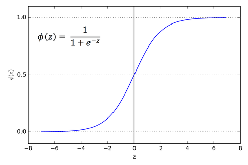
- also called logistic function
- currently considered to be deprecated for use in internal layers of neural networks

#### 4.4.2 Hyperbolic Tangent (tanh)
$$
\tanh (x)=\frac{e^{2 x}-1}{e^{2 x}+1}
$$
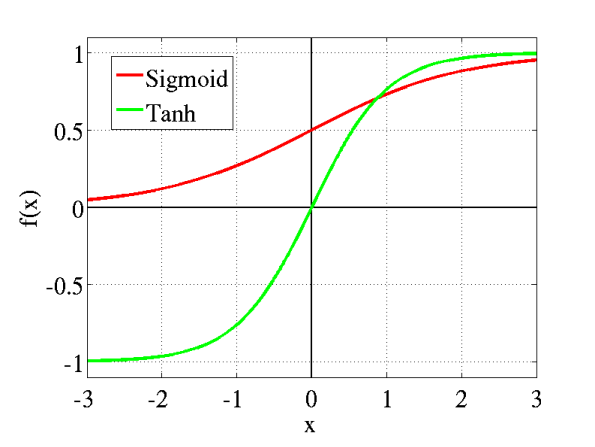

#### 4.4.3 Hard tanh

$$
\operatorname{hardtanh}(x)=\left\{\begin{array}{ll}
-1 & x<-1 \\\\
1 & x>1 \\\\
x & \text { otherwise }
\end{array}\right.
$$

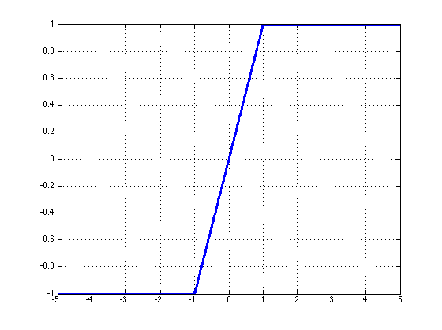
- an approximation of the tanh function
- faster to compute and take derivatives of

#### 4.4.4 Rectifier (ReLU)
The Rectifier activation function

$$
\operatorname{ReLU}(x)=\max (0, x)=\left\{\begin{array}{ll}
0 & x<0 \\\\
x & \text { otherwise }
\end{array}\right.
$$

- performs well for many tasks, especially when combined with the dropout regularization technique
- As a rule of thumb, ReLU units work better than tanh, and tanh works better than sigmoid.

### 4.5 Output Transformations
softmax:

$$
\begin{aligned}
\mathbf{x} &=x\_{1}, \ldots, x\_{k} \\\\
\operatorname{softmax}\left(x\_{i}\right) &=\frac{e^{x\_{i} }}{\sum\_{j=1}^{k} e^{x\_{j} }}
\end{aligned}
$$

- used when modeling a probability distribution over the possible output classes
- To be effective, it should be used in conjunction with a probabilistic training objective such as cross-entropy
- 如在不含hidden layer的network上使用softmax，即multinomial logistic regression model，也即maximum-entropy classifier

### 4.6 Embedding Layers
$c(\cdot)$: core features -> input vector
- concatenate:
$$
\begin{aligned}
\mathbf{x}=c\left(f\_{1}, f\_{2}, f\_{3}\right) &=\left[v\left(f\_{1}\right) ; v\left(f\_{2}\right) ; v\left(f\_{3}\right)\right] \\\\
\mathrm{NN}\_{\mathrm{MLP} 1}(\mathbf{x}) &=\mathrm{NN}\_{\mathrm{MLP} 1}\left(c\left(f\_{1}, f\_{2}, f\_{3}\right)\right) \\\\
&=\mathrm{N} \mathrm{N}\_{\mathrm{MLP} 1}\left(\left[v\left(f\_{1}\right) ; v\left(f\_{2}\right) ; v\left(f\_{3}\right)\right]\right) \\\\
&=\left(g\left(\left[v\left(f\_{1}\right) ; v\left(f\_{2}\right) ; v\left(f\_{3}\right)\right] \mathbf{W}^{1}+\mathbf{b}^{1}\right)\right) \mathbf{W}^{2}+\mathbf{b}^{2}
\end{aligned}
$$
- sum:
$$
\begin{aligned}
\mathbf{x}=c\left(f\_{1}, f\_{2}, f\_{3}\right) &=v\left(f\_{1}\right)+v\left(f\_{2}\right)+v\left(f\_{3}\right) \\\\
\mathrm{NN}\_{\mathrm{MLP} 1}(\mathbf{x}) &=\mathrm{NN}\_{\mathrm{MLP} 1}\left(c\left(f\_{1}, f\_{2}, f\_{3}\right)\right) \\\\
&=\mathrm{NN}\_{\mathrm{MLP} 1}\left(v\left(f\_{1}\right)+v\left(f\_{2}\right)+v\left(f\_{3}\right)\right) \\\\
&=\left(g\left(\left(v\left(f\_{1}\right)+v\left(f\_{2}\right)+v\left(f\_{3}\right)\right) \mathbf{W}^{1}+\mathbf{b}^{1}\right)\right) \mathbf{W}^{2}+\mathbf{b}^{2}
\end{aligned}
$$
- embedding layer / lookup layer: $c$
$$
v\left(f\_{i}\right)=\mathbf{f}\_{\mathbf{i} } \mathbf{E}
$$
$$
\operatorname{CBOW}\left(f\_{1}, \ldots, f\_{k}\right)=\sum\_{i=1}^{k}\left(\mathbf{f}\_{\mathbf{i} } \mathbf{E}\right)=\left(\sum\_{i=1}^{k} \mathbf{f}\_{\mathbf{i} }\right) \mathbf{E}
$$

#### 4.6.1 A Note on Notation
$$
([\mathbf{x} ; \mathbf{y} ; \mathbf{z}] \mathbf{W}+\mathbf{b})
$$
is same as affine transformation:
$$
(\mathrm{x} \mathbf{U}+\mathbf{y} \mathbf{V}+\mathbf{z} \mathbf{W}+\mathbf{b})
$$

#### 4.6.2 A Note on Sparse vs. Dense Features
“traditional” sparse representation for its input vectors, input:
$$
\mathbf{x}=\sum\_{i=1}^{k} \mathbf{f}\_{\mathbf{i} } \quad \mathbf{x} \in \mathbb{N}\_{+}^{|V|}
$$
first layers:
$$
\begin{array}{l}
\mathrm{xW}+\mathrm{b}=\left(\sum\_{i=1}^{k} \mathrm{f}\_{\mathrm{i} }\right) \mathbf{W} \\\\
\mathbf{W} \in \mathbb{R}^{|V| \times d}, \quad \mathbf{b} \in \mathbb{R}^{d}
\end{array}
$$
- similar to embedding layer that produces CBOW
- difference:
	1. the introduction of the bias vector b
	2. non-linear activation
	3. each feature receive a separate vector (row in $\mathbf{W}$) while embedding layer can share
	4. these differences are small and subtle

### 4.7 Loss Functions
- parameters of the network: the matrices $\mathbf{W^i}$, the biases $\mathbf{b^i}$ and commonly the embeddings $\mathbf{E}$ 

#### 4.7.1 Hinge (binary) / margin loss / SVM loss
合页损失（长得像合页）
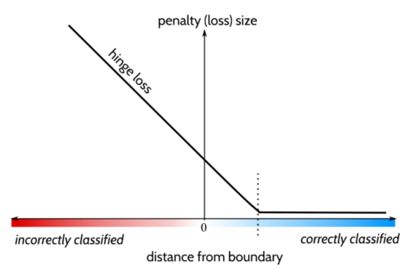
$$
L\_{\text {hinge(binary) } }(\hat{y}, y)=\max (0,1-y \cdot \hat{y})
$$

#### 4.7.2 Hinge (multiclass)
$$
\text { prediction }=\arg \max \_{i} \hat{y}\_{i}
$$
$t=\arg \max \_{i} y\_{i}$ the correct class, $k=\arg \max \_{i \neq t} \hat{y}\_{i}$ the highest scoring class such that $k \neq t$, multiclass hinge loss:
$$
L\_{\text {hinge(multiclass) } }(\hat{\mathbf{y} }, \mathbf{y})=\max \left(0,1-\left(\hat{y}\_{t}-\hat{y}\_{k}\right)\right)
$$

- Both the binary and multiclass hinge losses are intended to be used with a linear output layer
- The hinge losses are useful whenever we require a hard decision rule, and do not attempt to model class membership probability.

#### 4.7.3 Log Loss
“soft” version of the hinge loss with an infinite margin
$$
L\_{l o g}(\hat{\mathbf{y} }, \mathbf{y})=\log \left(1+\exp \left(-\left(\hat{y}\_{t}-\hat{y}\_{k}\right)\right)\right.
$$

#### 4.7.4 Categorical Cross-Entropy Loss
- also referred to as *negative log likelihood*
- used when a probabilistic interpretation of the scores is desired
$$
\hat{y}\_{i}=P(y=i \mid \mathbf{x})
$$
$$
L\_{\text {cross-entropy } }(\hat{\mathbf{y} }, \mathbf{y})=-\sum\_{i} y\_{i} \log \left(\hat{y}\_{i}\right)
$$
- hard classification problems: each training example has a single correct class assignment, $\mathbf{y}$ is one-hot:
$$
L\_{\text {cross-entropy }(\text { hard classification })}(\hat{\mathbf{y} }, \mathbf{y})=-\log \left(\hat{y}\_{t}\right)
$$
- When using the cross-entropy loss, it is assumed that the network’s output is transformed using the softmax transformation

#### 4.7.5 Ranking Losses
With pairs of correct and incorrect (by corrupting a positive example) items x and x′, and our goal is to score correct items above incorrect ones. 

$$
L\_{\text {ranking }(\operatorname{margin})}\left(\mathbf{x}, \mathbf{x}^{\prime}\right)=\max \left(0,1-\left(\mathrm{NN}(\mathbf{x})-\mathrm{NN}\left(\mathbf{x}^{\prime}\right)\right)\right)
$$

$$
L\_{\text {ranking }(\log )}\left(\mathbf{x}, \mathbf{x}^{\prime}\right)=\log \left(1+\exp \left(-\left(\mathrm{NN}(\mathbf{x})-\mathrm{NN}\left(\mathbf{x}^{\prime}\right)\right)\right)\right)
$$

## 5. Word Embeddings
embeddings: representing each feature as a vector in a low dimensional space

### 5.1 Random Initialization
- Random Initialization
	- [Mikolov et al., 2013]: $\left[-\frac{1}{2 d}, \frac{1}{2 d}\right]$ 
	- xavier initialization (Section 6.3.1): $\left[-\frac{\sqrt{6} }{\sqrt{d} }, \frac{\sqrt{6} }{\sqrt{d} }\right]$
- in practice
	- random initialization: for commonly occurring features, eg. part-of-speech tags or individual letters
	- supervised or unsupervised pre-training: for potentially rare features, eg. features for individual words
		- treate pre-trained vectors as fixed or further tuned.

### 5.2 Supervised Task-Specific Pre-training
- use auxiliary task B (say, part-of-speech tagging) to pre-train word vectors for task A (eg. syntactic parsing)
	- or train jointly (Section 7)

### 5.3 Unsupervised Pre-training
- distributional hypothesis (Harris, 1954): words are similar if they appear in similar contexts
- It is thus desired that the similarity between word vectors learned by the unsupervised algorithm captures the same aspects of similarity that are useful for performing the intended task of the network.
- unsupervised word-embedding algorithms
	- word2vec(Mikolov et al., 2013)
	- GloVe (Pennington, Socher, & Manning, 2014)
	- the Collobert and Weston (2008, 2011) embeddings algorithm
		- all above based on stochastic gradient training
	- algorithms based on matrix factorization
- the choice of auxiliary problem matters much more than the learning method
- software packages
	- word2vec, Gensim: word2vec model with word-windows based contexts
	- word2vecf: allowing the use of arbitrary contexts
	- GloVe: GloVe model
- have many other applications in NLP beyond initializing word-embeddings layer of NN

### 5.4 Training Objectives
1. Language-modeling inspired approaches: model the conditional probability P(w|c)
	- Mikolov et al. (2013)
	- Mnih and Kavukcuoglu (2013)
	- GloVe (Pennington et al., 2014)
2. binary classification
	- Collobert and Weston (2008, 2011) 
	- Mikolov et al. (2013, 2014)

### 5.5 The Choice of Contexts
- symmetric window rather than preivous words in original language model

#### 5.5.1 Window Approach
- a sequence of 2k +1 words
- tow approach
	- one task: predict the focus word based on context words (represented using CBOW [Mikolov et al., 2013] or vector concatenation [Collobert & Weston, 2008])
	- 2k tasks (skip-gram, often SOTA) [Mikolov et al., 2013]
- Effect of Window Size
	- larger: topical similarities
	- smaller: functional and syntatic similarities
- Positional Windows
	- CBOW和skip-gram丢失了位置信息
	- positional contexts, eg. “the:+2”
- Variants

#### 5.5.2 Sentences, Paragraphs or Documents
skip-grams (or CBOW) is equivalent to using very large window sizes.
- capture topical similarity

#### 5.5.3 Syntactic Window
replace the linear context within a sentence with a syntactic one
- produce highly functional similarities

#### 5.5.4 Multilingual
using multilingual, translation based contexts

#### 5.5.5 Character-Based and Sub-word Representations
derive the vector representation of a word from the characters that compose it
- motivation: unknown words problem
- challenging, as the 	relationship between form (characters) and function (syntax, semantics)in language is quite loose

middle-ground: vector for word + vectors of sub-word

## 6. Neural Network Training
### 6.1 Stochastic Gradient Training
SGD:
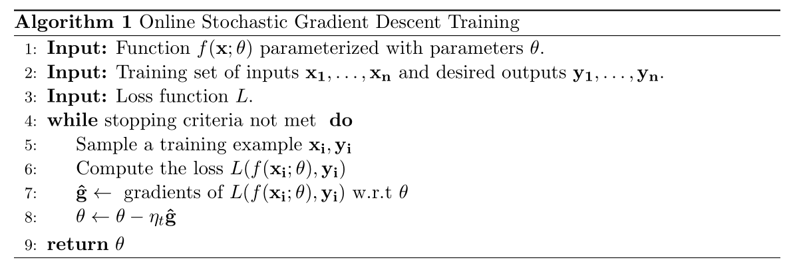

minibatch SGD:
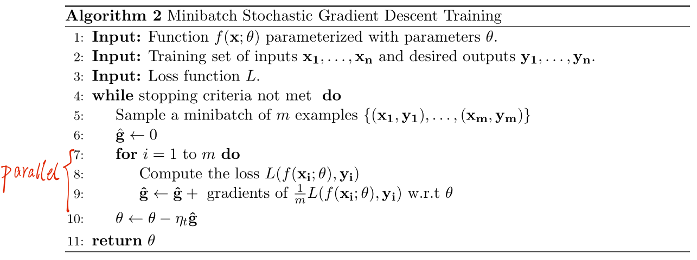

others:
- SGD + Momentum
- Nesterov Momentum
- Adaptive learning rate: AdaGrad, AdaDelta, Adam

### 6.2 The Computation Graph Abstraction
computation graph: directed acyclic graph(DAG)

example of compution:
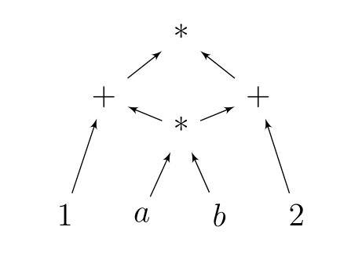

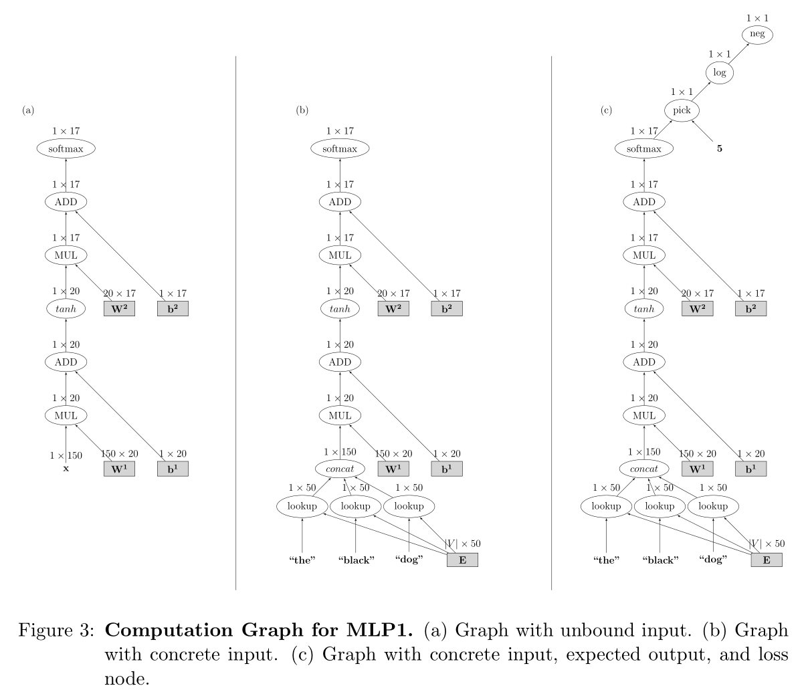

#### 6.2.1 Forward Computation
topological order:
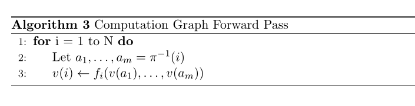

#### 6.2.2 Backward Computation (Derivatives, Backprop)
误差乘以偏导再求和
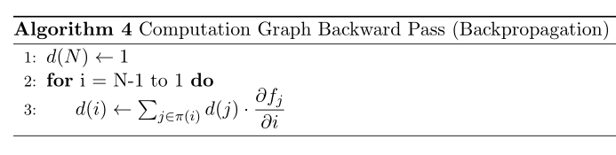

#### 6.2.3 Software
implement computation-graph model: Theano, Chainer, penne, CNN/pyCNN

Theano has optimizing compiler
- pros: run efficiently on either the CPU or a GPU
- cons: compilation can be costly

other packages dynamic CG "on the fly":
- cons: speed may suffer
- especially convenient with recurrnt and recursive networds

#### 6.2.4 Implementation Recipe
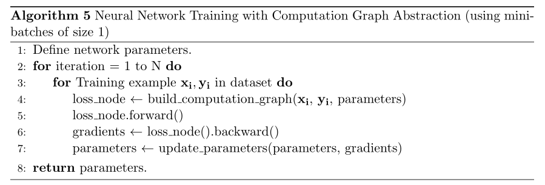

#### 6.2.5 Network Composition
when networks's output is a vector, easy to compose

### 6.3 Optimization Issues
further: Bengio et al. (2015, ch. 8)

#### 6.3.1 Initialization
> tips: When debugging, and for reproducibility of results, it is advised to used a fixed random seed.

xavier initialization: 
$$
\mathbf{W} \sim U\left[-\frac{\sqrt{6} }{\sqrt{d\_{\mathrm{in} }+d\_{\mathrm{out} }} },+\frac{\sqrt{6} }{\sqrt{d\_{\mathrm{in} }+d\_{\mathrm{out} }} }\right]
$$

- too large or too small cause saturated
- internal covariate shift: use batch normalization, adjust inputs to fix the activation function (vice versa)
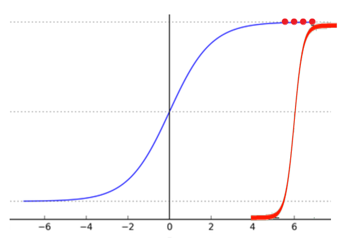
[*image source*](https://medium.com/@shiyan/xavier-initialization-and-batch-normalization-my-understanding-b5b91268c25c)

He et al. (2015): ReLU initialized by sampling from a zero-mean Gaussian distribution whose standard deviation is $\sqrt{\frac{2}{d\_{\text {in } }} }$, works better than xavier in image classification

#### 6.3.2 Vanishing and Exploding Gradients
especially in deeper networks, recursive and recurrent networks

solutions for vanishing (still open research):
- shallower
- step-wise training
- batch-normalization(for every minibatch, normalizing the inputs to each of the network layers to have zero mean and unit variance) 
- specialized architectures for gradient flow (e.g.  LSTM and GRU)

solution for exploding:
- clipping the gradients if their norm exceeds a given threshold

#### 6.3.3 Saturation and Dead Neurons

Saturated:
- layers with tanh and sigmoid
- output values all close to one

Dead:
- layers with ReLU
- most or all values are negative and thus clipped at zero

solutions:
- avoid large gradient (reduce learning rate)
- for saturated: 
	- normalize after activation, $g(\mathbf{h})=\frac{\tanh (\mathbf{h})}{\|\tanh (\mathbf{h})\|}$
	- batch normalization (important in CV)

#### 6.3.4 Shuffling
shuffle the training examples before each pass

#### 6.3.5 Learning Rate
rule of thumb: try $[0,1]$, e.g. 0.001, 0.01, 0.1, 1
decrease rate once the loss stops improving

Learning rate scheduling: 
- learning rate / iter
- L´eon Bottou (2012): $\eta\_{t}=\eta\_{0}\left(1+\eta\_{0} \lambda t\right)^{-1}$

#### 6.3.6 Minibatches
benefit from GPUs

### 6.4 Regularization
to alleviate overfitting

add to objective function:
$$
\frac{\lambda}{2}\|\theta\|^{2}
$$

dropout: 每批训练中，忽略一半（或某层中一半）特征检测器（设为0），减少特征检测器（隐层结点）之间的相互作用。
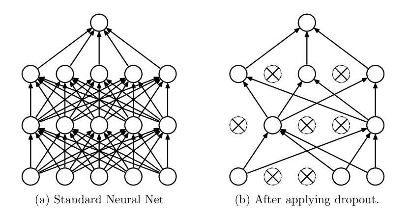
*Srivastava, Nitish, et al. ”Dropout: a simple way to prevent neural networks from overfitting”, JMLR 2014*
- key factors in image classification, especially with ReLU
- also matters in NLP

## 7. Cascading and Multi-task Learning

### 7.1 Model Cascading
build large networks with smaller component networks

to cambat vanishing gradient and make the most of training material, bootstrap component networks's parameters by training separately

### 7.2 Multi-task Learning
e.g.  chunking, named entity recognition (NER) and language modeling are examples of synergistic tasks

## 8. Structured Output Prediction
structured ouput: sequence, tree, graph
e.g. sequence tagging, sequence segmentation(chunking, NER) and syntactic parsing.

### 8.1 Greedy Structured Prediction
decompose into a sequence of local prediction problems (classifier)
e.g. 
-left-to-right tagging models (Gimenez & Marquez, 2004)
- greedy transition-based parsing (Nivre, 2008)

cons: error propagation
- nonlinear NN classifier helps
- the easy-first approach in Goldberg & Elhadad, 2010
- making training conditions more similar to testing conditions by exposing the training procedure to inputs that result from likely mistakes

### 8.2 Search Based Structured Prediction
also: energy based learning (LeCun et al., 2006, Section 7)

Search-based structured prediction is formulated as a search problem over possible structures:
$$
\operatorname{predict}(x)=\underset{y \in \mathcal{Y}(x)}{\arg \max } \operatorname{score}(x, y)
$$

scoring function:
$$
\operatorname{score}(x, y)=\mathbf{w} \cdot \Phi(x, y)
$$
- Φ is a feature extraction function and w is a weight vector

decomposed y:
$$
\Phi(x, y)=\sum\_{p \in \operatorname{parts}(x, y)} \phi(p)
$$
$$
\operatorname{score}(x, y)=\mathbf{w} \cdot \Phi(x, y)=\mathbf{w} \cdot \sum\_{p \in y} \phi(p)=\sum\_{p \in y} \mathbf{w} \cdot \phi(p)=\sum\_{p \in y} \operatorname{score}(p)
$$

replace linear scoring function with NN:
$$
\operatorname{score}(x, y)=\sum\_{p \in y} \operatorname{score}(p)=\sum\_{p \in y} \mathrm{NN}(c(p))
$$
- c(p) maps the part p into a $d\_{in}$ dimensional vector

eg. one-hidden-layer MLP:
$$
\operatorname{score}(x, y)=\sum\_{p \in y} \mathrm{NN}\_{\mathrm{MLP1} }(c(p))=\sum\_{p \in y}\left(g\left(c(p) \mathbf{W}^{1}+\mathbf{b}^{1}\right)\right) \mathbf{w}
$$

find the best scoring structure $y'$, generalized perceptron loss:
$$
\max \_{y^{\prime} } \operatorname{score}\left(x, y^{\prime}\right)-\operatorname{score}(x, y)
$$

LeCun et al. (2006, Section 5), margin-based hinge loss:
$$
\max \left(0, m+\max \_{y^{\prime} \neq y} \operatorname{score}\left(x, y^{\prime}\right)-\operatorname{score}(x, y)\right)
$$

#### 8.2.1 Probabilistic Objective (CRF)
conditional random fields, “CRF”: treat each parts scores as a *clique potential* and define score:
$$
\begin{aligned}
\operatorname{score}\_{\mathrm{CRF} }(x, y)=P(y \mid x) &=\frac{\exp \left(\sum\_{p \in y} \operatorname{score}(p)\right)}{\sum\_{y^{\prime} \in \mathcal{Y}(x)} \exp \left(\sum\_{p \in y^{\prime} } \operatorname{score}(p)\right)} \\\\
&=\frac{\exp \left(\sum\_{p \in y} \operatorname{NN}(\phi(p))\right)}{\sum\_{y^{\prime} \in \mathcal{Y}(x)} \exp \left(\sum\_{p \in y^{\prime} } \operatorname{NN}(\phi(p))\right)}
\end{aligned}
$$

loss for training example (x,y): 
$$
-\log \operatorname{score}\_{\mathrm{CRF} }(x, y)
$$

- 分母需要计算所有指数多的可能结构，可以用DP, e.g.
	- the forward-backward viterbi recurrences for sequences
	- the CKY insideoutside recurrences for tree structures

- approximate methods for computing the partition function:
	- eg. beam search (波束搜索) for inference

#### 8.2.2 Reranking
reranking framework: base model produce k-best scoring structures, complex model scores the candidates in the k-best list

#### 8.2.3 MEMM and Hybrid Approaches
- 可以将MEMM中的logistic regression（Maximum Entropy）替换为MLP
- Hybrid between NN and linear models
	- Weiss et al. (2015): transition-based dependency parsing in a two-stage (MLP2 and NN) model

## 9. Convolutional Layers
CBOW忽略了位置信息("good, not bad" == "bad, not good")
- embedding word-pairs (bi-grams) -> huge embedding matrices, sparsity
- convolution-and-pooling (CNNs)

CNN:
- evolved in CV (LeCun & Bengio, 1995)
- bject detectors (Krizhevsky et al., 2012)
- images using 2-d, text using 1-d
- evolved in NLP, semantic-role labeling (Collobert, Weston and colleagues, 2011)
- sentiment and question-type classification (Kalchbrenner et al. (2014) and Kim (2014))

### 9.1 Basic Convolution + Pooling
convolution: each k-word window -> d-dimensional vector (filter)
pooling: all d-dimensional vector -> single d-dimensional vector (max or average)
- 即滑窗学习有价值的k-grams
- 是否在两端填充：
	- narrow convolution: m = n − k + 1 windows
	- wide convolution: m = n + k + 1 windows

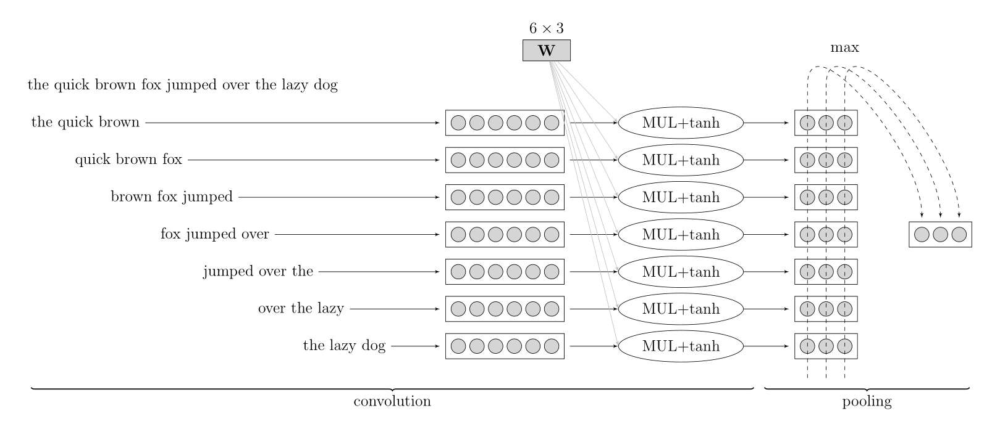
convolution layer:
- m vectors p1, . . . , pm, $\mathbf{p}\_{\mathbf{i} } \in \mathbb{R}^{d\_{\text {conv } }}$
$$
\mathbf{p}\_{\mathbf{i} }=g\left(\mathbf{w}\_{\mathbf{i} } \mathbf{W}+\mathbf{b}\right)
$$
- 其中 $\mathbf{W} \in \mathbb{R}^{k \cdot d\_{\mathrm{emb} } \times d\_{\mathrm{conv} }}$

max-pooling:
$$
c\_{j}=\max \_{1<i \leq m} \mathbf{p}\_{\mathbf{i} }[j]
$$

### 9.2 Dynamic, Hierarchical and k-max Pooling
根据领域知识将每个窗口对应的 $\mathbf{p}_i$ 划分为l组，每组分别pooling，再全部拼接

e.g. 关系抽取任务，给定两个词判断其关系，可以将窗口划分为两词前、两词后、两词之间三个部分，分别提取特征

hierarchy of convolutional layers

k-max pooling:
$$
\left[\begin{array}{lll}
1 & 2 & 3 \\\\
9 & 6 & 5 \\\\
2 & 3 & 1 \\\\
7 & 8 & 1 \\\\
3 & 4 & 1
\end{array}\right]
$$
- 1-max:
$$
\left[\begin{array}{lll}
9 & 8 & 5
\end{array}\right]
$$
- 2-max:
$$
\left[\begin{array}{lll}
9 & 6 & 3 \\\\
7 & 8 & 5
\end{array}\right]
$$
拼接为：
$$
\left[\begin{array}{llllll}
9 & 6 & 3 & 7 & 8 & 5
\end{array}\right]
$$

### 9.3 Variations
parallel convolutional layers: e.g. 4个平行convolutional layers分别采用用2-5的窗口，分别pooling再拼接

Ma et al. (2015) convolution on syntactic dependency trees

Liu et al. (2015) convolutional on top of dependency paths extracted from dependency trees

Le and Zuidema (2015) perform max pooling over vectors representing the different derivations leading to the same chart item in a chart parser

## 10. Recurrent Neural Networks – Modeling Sequences and Stacks
对比：
- CBOW: 没有order of features
- CNNs: 局部order
- RNNs（Elman, 1990）: 全局order

### 10.1 The RNN Abstraction
input:
- sequence of vectors $\mathbf{x}\_{\mathbf{i} }, \ldots, \mathbf{x}\_{\mathbf{j} }$
- initial state vector $\mathbf{s_o}$

output:
- state vectors: $\mathbf{s}\_{1}, \ldots, \mathbf{s}\_{\mathbf{n} }$
- output vectors: $\mathbf{y}\_{1}, \ldots, \mathbf{y}\_{\mathbf{n} }$

$\mathbf{y_i}$ for further prediction:
$$
p\left(e=j \mid \mathbf{x}\_{\mathbf{1}: \mathbf{i} }\right)=\operatorname{softmax}\left(\mathbf{y}\_{\mathbf{i} } \mathbf{W}+\mathbf{b}\right)[j]
$$

RNN don't need Markov assumption, and works better than n-gram.

$$
\begin{array}{c}
\mathrm{RNN}\left(\mathrm{s}\_{0}, \mathrm{x}\_{1: \mathrm{n} }\right)=\mathrm{s}\_{1: \mathrm{n} }, \mathrm{y}\_{1: \mathrm{n} } \\\\
\mathrm{s}\_{\mathrm{i} }=R\left(\mathrm{~s}\_{\mathrm{i}-1}, \mathrm{x}\_{\mathrm{i} }\right) \\\\
\mathrm{y}\_{\mathrm{i} }=O\left(\mathrm{~s}\_{\mathrm{i} }\right) \\\\
\mathrm{x}\_{\mathrm{i} } \in \mathbb{R}^{d\_{i n} }, \quad \mathbf{y}\_{\mathrm{i} } \in \mathbb{R}^{d\_{\text {out } }}, \quad \mathrm{s}\_{\mathrm{i} } \in \mathbb{R}^{f\left(d\_{\text {out } }\right)}
\end{array}
$$
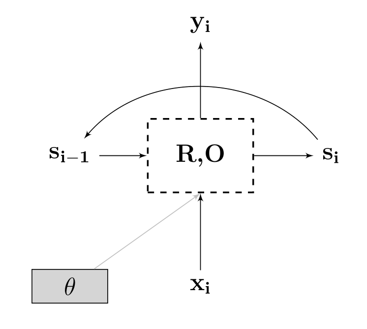
unroll:
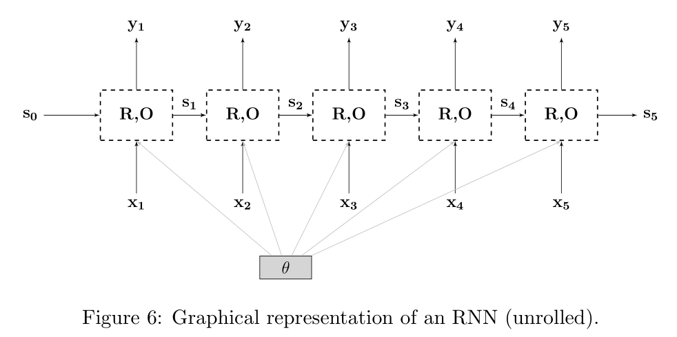
- $O$ function:
	- Simple RNN (Elman Rnn) / GRU: identity mapping
	- LSTM: fixed subset of state

### 10.2 RNN Training
backpropagation through time (BPTT): with unrolled computation graph.
- variants of BPTT: 
	- k-size unrolling
	- forward entire, backward k

#### 10.2.1 Acceptor 接收器
接收整个句子，从final output决策，loss根据$\mathbf{y}\_{\mathbf{n} }=O\left(\mathbf{s}\_{\mathbf{n} }\right)$定义，再BP回序列其他部分
- eg. part-of-speech, sentiment analysis, non-phrase classfication
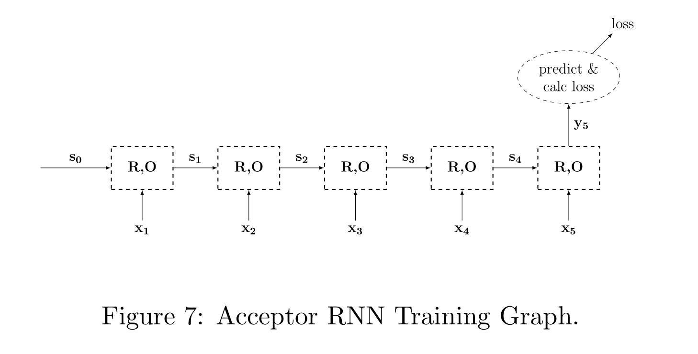
- 序列过长时，由于梯度消失，很难训练
- 输入没有指明重点（？），很难训练

#### 10.2.2 Encoder 编码器
也是只用final output，但将$\mathbf{y_n}$作为整个序列的信息，与其他信息一起使用。

#### 10.2.3 Transducer 转换器
an output for each input
e.g. 
- sequence tagger (SOTA CCG super-tagger: (Xu et al., 2015))
- language modeling

loss (or average / weighted average):
$$
L\left(\mathbf{y} \hat{\mathbf{1}: \mathbf{n} }, \mathbf{y}\_{\mathbf{1}: \mathbf{n} }\right)=\sum\_{i=1}^{n} L\_{\text {local } }\left(\hat{\mathbf{y} }\_{\mathbf{i} }, \mathbf{y}\_{\mathbf{i} }\right)
$$
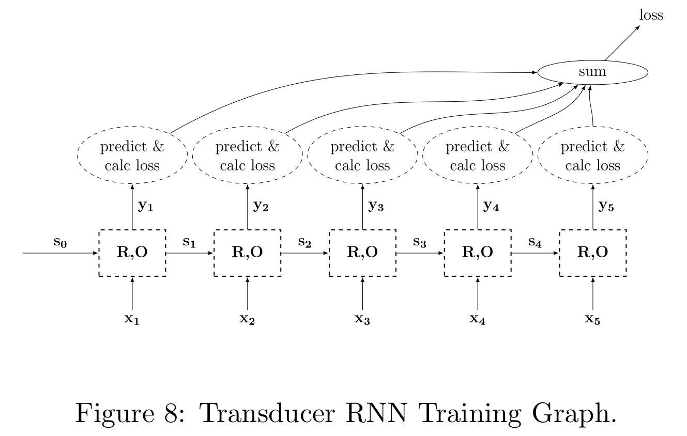

RNN transduces relax the Markov assumption and condition on the entire history. (powerful!)
- generative character-level RNN models  (Sutskever, Martens, & Hinton, 2011)
- 生成的文本相比n-gram捕捉了更多性质，e.g. 句子长度、括号匹配 Karpathy, (Johnson, and Li, 2015)

#### 10.2.4 Encoder - Decoder
encoder output as auxiliary input to decoder (transducer-like)
eg. 
- machine-translation, great using LSTM (Sutskever et al., 2014)
	- 输入句子倒置，使得$\mathbf{X_n}$对应开头，翻译时一一对应，效果更好
- sequence transduction

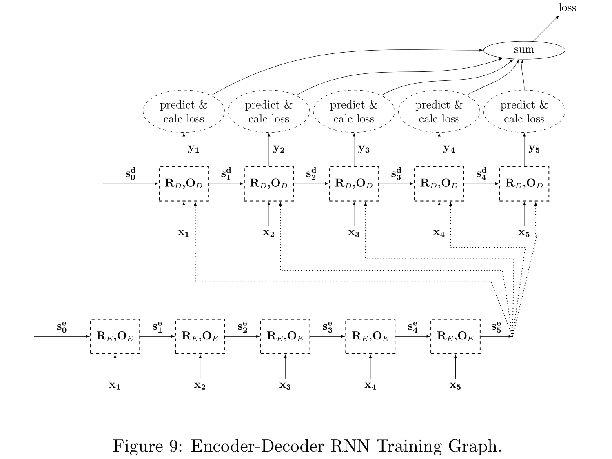

### 10.3 Multi-layer (Stacked) RNNs
also called deep RNNs
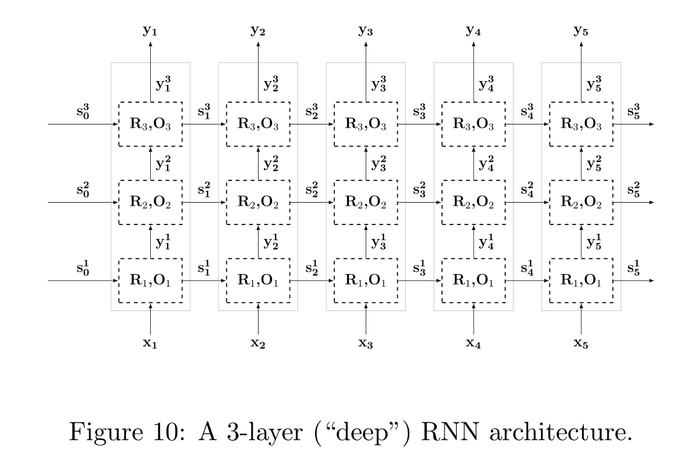

deep RNNs works better than shallower ones on some tasks:
- Sutskever et al. (2014) 4-layers RNN for machine-translation
- Irsoy and Cardie (2014) biRNN with several layers

### 10.4 Bidirectional RNNs (biRNN)
(Schuster & Paliwal, 1997; Graves, 2008)

biRNN relaxes the fixed window size assumption, allowing to look arbitrarily far at both the past and the future

two **independent** RNN:
- $\mathrm{RNN}\left(R^{f}, O^{f}\right)$ input $\mathbf{X}\_{\mathbf{1}: \mathbf{n} }$
- $\mathrm{RNN}\left(R^{b}, O^{b}\right)$ input $\mathbf{X}\_{\mathbf{n}: \mathbf{1} }$

output:
$$
\mathbf{y}\_{\mathbf{i} }=\left[\mathbf{y}\_{\mathbf{i} }^{\mathbf{f} } ; \mathbf{y}\_{\mathbf{i} }^{\mathbf{b} }\right]=\left[O^{f}\left(\mathbf{s}\_{\mathbf{i} }^{\mathbf{f} }\right) ; O^{b}\left(\mathbf{s}\_{\mathbf{i} }^{\mathbf{b} }\right)\right]
$$

biRNNs for sequence tagging (Irsoy and Cardie, 2014)

### 10.5 RNNs for Representing Stacks
main intuition: Encode the stack sequence

- push: $\mathrm{s}\_{\mathrm{i+1} }=R(\mathrm{s}\_{\mathrm{i} }, \mathrm{x\_{i+1} })$
- pop: persistent-stack (immutable) data-structure

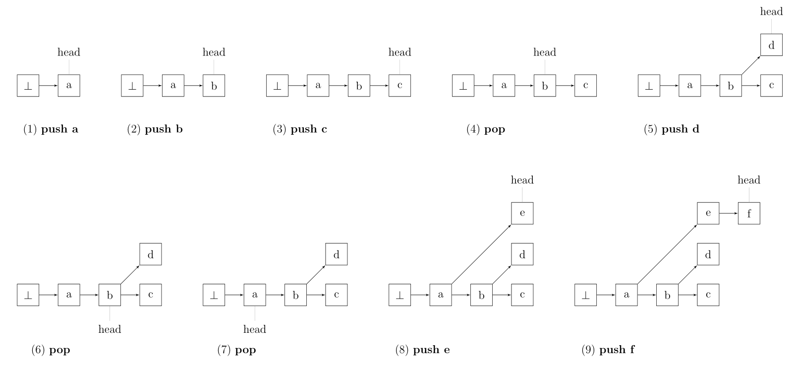

### 10.6 A Note on Reading the Literature
Many aspects of the models are not yet standardized, be careful with ambiguous.

## 11. Concrete RNN Architectures

### 11.1 Simple RNN (SRNN)
also: Elman Network (Elman, 1990)

$$
\begin{array}{c}
\mathbf{S}\_{\mathbf{i} }=R\_{\mathrm{SRNN} }\left(\mathbf{s}\_{\mathbf{i}-\mathbf{1} }, \mathbf{x}\_{\mathbf{i} }\right)=g\left(\mathbf{x}\_{\mathbf{i} } \mathbf{W}^{\mathbf{x} }+\mathbf{s}\_{\mathbf{i}-\mathbf{1} } \mathbf{W}^{\mathbf{s} }+\mathbf{b}\right) \\\\
\mathbf{y}\_{\mathbf{i} }=O\_{\mathrm{SRNN} }\left(\mathbf{s}\_{\mathbf{i} }\right)=\mathbf{s}\_{\mathbf{i} } \\\\
\mathbf{s}\_{\mathbf{i} }, \mathbf{y}\_{\mathbf{i} } \in \mathbb{R}^{d\_{s} }, \mathbf{x}\_{\mathbf{i} } \in \mathbb{R}^{d\_{x} }, \mathbf{W}^{\mathbf{x} } \in \mathbb{R}^{d\_{x} \times d\_{s} }, \mathbf{W}^{\mathbf{s} } \in \mathbb{R}^{d\_{s} \times d\_{s} }, \mathbf{b} \in \mathbb{R}^{d\_{s} }
\end{array}
$$

- strong result in sequence tagging (Xu et al., 2015) and language modeling
- hard to train for vanishing gradients

more discussion: PhD thesis by Mikolov (2012)

### 11.2 Long Short-Term Memory (LSTM)
(Hochreiter & Schmidhuber, 1997)
 
S-RNN hard to capture long-range dependencies, LSTM can solve this vanishing gradients problem.

- memory cells: preserve gradients across time
- gating components: smooth mathematical functions that simulate logical gates, control access to the memory cells
- gete: (after sigmoid) vector $\mathrm{g} \in[0,1]^{n}$

$$\begin{aligned} \mathbf{s}\_{\mathbf{j} }=R\_{\mathrm{LSTM} }\left(\mathbf{s}\_{\mathbf{j}-\mathbf{1} }, \mathbf{x}\_{\mathbf{j} }\right) &=\left[\mathbf{c}\_{\mathbf{j} } ; \mathbf{h}\_{\mathbf{j} }\right] \\\\ \mathbf{c}\_{\mathbf{j} } &=\mathbf{c}\_{\mathbf{j}-\mathbf{1} } \odot \mathbf{f}+\mathbf{g} \odot \mathbf{i} \\\\ \mathbf{h}\_{\mathbf{j} } &=\tanh \left(\mathbf{c}\_{\mathbf{j} }\right) \odot \mathbf{o} \\\\ \mathbf{i} &=\sigma\left(\mathbf{x}\_{\mathbf{j} } \mathbf{W}^{\mathbf{x} \mathbf{i} }+\mathbf{h}\_{\mathbf{j}-\mathbf{1} } \mathbf{W}^{\mathbf{h i} }\right) \\\\ \mathbf{f} &=\sigma\left(\mathbf{x}\_{\mathbf{j} } \mathbf{W}^{\mathbf{x f} }+\mathbf{h}\_{\mathbf{j}-\mathbf{1} } \mathbf{W}^{\mathbf{h f} }\right) \\\\ \mathbf{o} &=\sigma\left(\mathbf{x}\_{\mathbf{j} } \mathbf{W}^{\mathbf{x} \mathbf{o} }+\mathbf{h}\_{\mathbf{j}-\mathbf{1} } \mathbf{W}^{\mathbf{h o} }\right) \\\\ \mathbf{g} &=\tanh \left(\mathbf{x}\_{\mathbf{j} } \mathbf{W}^{\mathbf{x g} }+\mathbf{h}\_{\mathbf{j}-\mathbf{1} } \mathbf{W}^{\mathbf{h g} }\right) \\\\ \mathbf{y}\_{\mathbf{j} }=O\_{\mathrm{LSTM} }\left(\mathbf{s}\_{\mathbf{j} }\right) &=\mathbf{h}\_{\mathbf{j} } \end{aligned}$$

$$\mathbf{j} \in \mathbb{R}^{2 \cdot d\_{h} }, \mathbf{x}\_{\mathbf{i} } \in \mathbb{R}^{d\_{x} }, \mathbf{c}\_{\mathbf{j} }, \mathbf{h}\_{\mathbf{j} }, \mathbf{i}, \mathbf{f}, \mathbf{o}, \mathbf{g} \in \mathbb{R}^{d\_{h} }, \mathbf{W}^{\mathbf{x} \circ} \in \mathbb{R}^{d\_{x} \times d\_{h} }, \mathbf{W}^{\mathbf{h} \circ} \in \mathbb{R}^{d\_{h} \times d\_{h} }$$

结构详解：https://colah.github.io/posts/2015-08-Understanding-LSTMs/
- f：遗忘门
	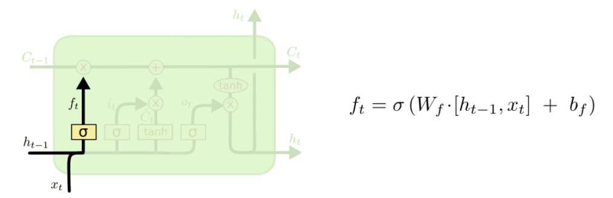
- i：记忆/输入门
	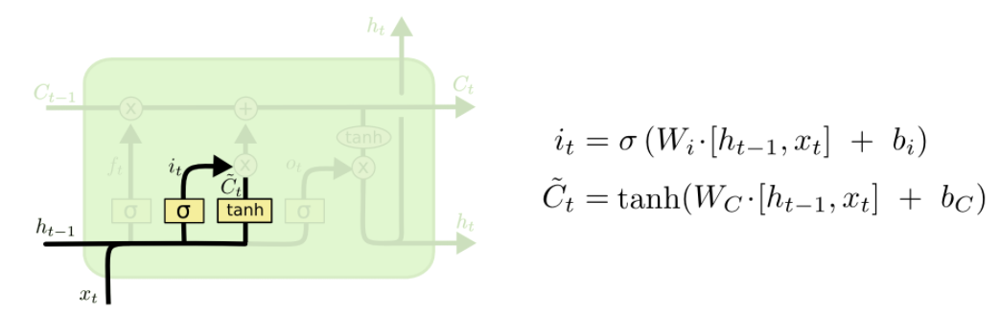
	- 更新Cell：
	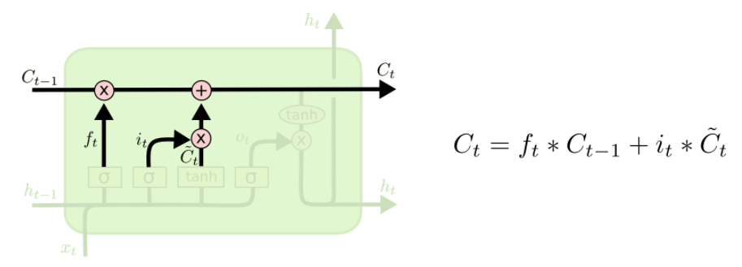
- o：输出门
	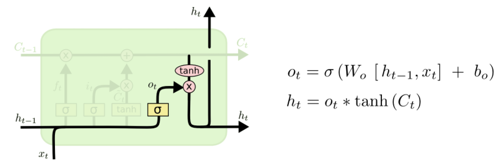

- further: PhD thesis by Alex Graves (2008)
- LSTM character-level language model: Karpathy et al. (2015)
- motivation: Sections 4.2 and 4.3 in the detailed course notes of Cho (2015)
- variants: Greff, Srivastava, Koutn´ık, Steunebrink, and Schmidhuber (2015)

Practical Considerations:
- initialize the bias term of the forget gate to be close to one when training (Jozefowicz et al., 2015)
- dropout only on the non-recurrent connection (Zaremba et al., 2014) 

### 11.3 Gated Recurrent Unit (GRU)
a simpler alternative to the LSTM, also based on a gating mechanism

$$\begin{aligned} \mathbf{s}\_{\mathbf{j} }=R\_{\mathrm{GRU} }\left(\mathbf{s}\_{\mathbf{j}-\mathbf{1} }, \mathbf{x}\_{\mathbf{j} }\right) &=(\mathbf{1}-\mathbf{z}) \odot \mathbf{s}\_{\mathbf{j}-\mathbf{1} }+\mathbf{z} \odot \tilde{\mathbf{s}\_{\mathbf{j} }} \\\\ \mathbf{z} &=\sigma\left(\mathbf{x}\_{\mathbf{j} } \mathbf{W}^{\mathbf{x} \mathbf{z} }+\mathbf{s}\_{\mathbf{j}-\mathbf{1} } \mathbf{W}^{\mathbf{s z} }\right) \\\\ \mathbf{r} &=\sigma\left(\mathbf{x}\_{\mathbf{j} } \mathbf{W}^{\mathbf{x r} }+\mathbf{s}\_{\mathbf{j}-\mathbf{1} } \mathbf{W}^{\mathbf{s r} }\right) \\\\ \tilde{\mathbf{s} }\_{\mathbf{j} } &=\tanh \left(\mathbf{x}\_{\mathbf{j} } \mathbf{W}^{\mathbf{x s} }+\left(\mathbf{s}\_{\mathbf{j}-\mathbf{1} } \odot \mathbf{r}\right) \mathbf{W}^{\mathrm{sg} }\right) \\\\ \mathbf{y}\_{\mathbf{j} }=O\_{\mathrm{GRU} }\left(\mathbf{s}\_{\mathbf{j} }\right) &=\mathbf{s}\_{\mathbf{j} } \end{aligned}$$

$$\mathbf{s}\_{\mathbf{j} }, \tilde{\mathbf{s} }\_{\mathbf{j} } \in \mathbb{R}^{d\_{s} }, \mathbf{x}\_{\mathbf{i} } \in \mathbb{R}^{d\_{x} }, \mathbf{z}, \mathbf{r} \in \mathbb{R}^{d\_{s} }, \mathbf{W}^{\mathbf{x} \circ} \in \mathbb{R}^{d\_{x} \times d\_{s} }, \mathbf{W}^{\mathbf{s} \circ} \in \mathbb{R}^{d\_{s} \times d\_{s} }$$

effective in language modeling and machine translation

### 11.4 Other Variants
Mikolov et al. (2014):  split the state vector si into a slow changing component $c_i$(“context units”) and a fast changing component $h_i$

Le, Jaitly, and Hinton (2015): set the activation function of the S-RNN to a ReLU, and initialize the biases b as zeroes and the matrix Ws as the identify matrix

## 12. Modeling Trees – Recursive Neural Networks
recursive neural network (RecNN): RNN from sequences to (binary) trees

tree node $p$ encodes the entrie subtree rooted at $p$
$$
\operatorname{vec}(p)=f\left(\operatorname{vec}\left(c\_{1}\right), \operatorname{vec}\left(c\_{2}\right)\right)
$$
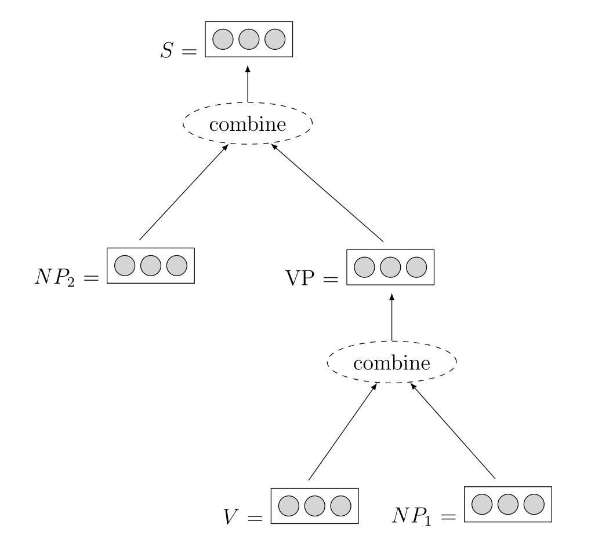

### 12.1 Formal Definition
解析树：
- unlabeled: 三元组集合 $(i, k, j)$
- labeled：六元组集合 $(A \rightarrow B, C, i, k, j)$

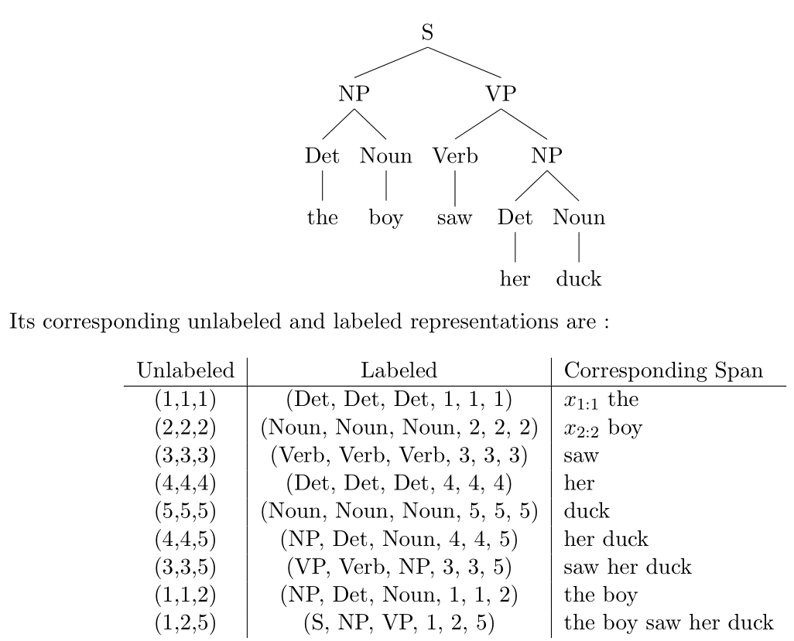

$$
\begin{aligned}
\operatorname{RecNN}\left(x\_{1}, \ldots, x\_{n}, \mathcal{T}\right) &=\left\{\mathbf{s}\_{\mathbf{i}: \mathbf{j} }^{\mathbf{A} } \in \mathbb{R}^{d} \mid q\_{i: j}^{A} \in \mathcal{T}\right\} \\\\
\mathbf{s}\_{\mathbf{i}: \mathbf{i} }^{\mathbf{A} } &=v\left(x\_{i}\right) \\\\
\mathbf{s}\_{\mathbf{i}: \mathbf{j} }^{\mathbf{A} } &=R\left(A, B, C, \mathbf{s}\_{\mathbf{i}: \mathbf{k} }^{\mathbf{B} }, \mathbf{s}\_{\mathbf{k}+\mathbf{1} :\mathbf{j} }^{\mathbf{C} }\right) \quad q\_{i: k}^{B} \in \mathcal{T}, \quad q\_{k+1: j}^{C} \in \mathcal{T}
\end{aligned}
$$

组合函数$R$:
$$
R\left(A, B, C, \mathbf{s}\_{\mathbf{i}: \mathbf{k} }^{\mathbf{B} }, \mathbf{s}\_{\mathbf{k}+\mathbf{1}:\mathbf{j} }^{\mathbf{C} }\right)=g\left(\left[\mathbf{s}\_{\mathbf{i}: \mathbf{k} }^{\mathbf{B} } ; \mathbf{s}\_{\mathbf{k}+\mathbf{1}: \mathbf{j} }^{\mathbf{C} }\right] \mathbf{W}\right)
$$

带有标签（label embeddings）的组合函数$R$:
$$
R\left(A, B, C, \mathbf{s}\_{\mathbf{i}: \mathbf{k} }^{\mathbf{B} }, \mathbf{s}\_{\mathbf{k}+\mathbf{1} : \mathbf{j} } \mathbf{C}\right)=g\left(\left[\mathbf{s}\_{\mathbf{i}: \mathbf{k} }^{\mathbf{B} } ; \mathbf{s}\_{\mathbf{k}+\mathbf{1} : \mathbf{j} }^{\mathbf{C} } ; v(A) ; v(B)\right] \mathbf{W}\right)
$$

也可以对每一对B、C采用不同的W:
$$
R\left(A, B, C, \mathbf{s}\_{\mathbf{i}: \mathbf{k} }^{\mathbf{B} }, \mathbf{s}\_{\mathbf{k}+\mathbf{1}: \mathbf{j} }^{\mathbf{C} }\right)=g\left(\left[\mathbf{s}\_{\mathbf{i}: \mathbf{k} }^{\mathbf{B} } ; \mathbf{s}\_{\mathbf{k}+\mathbf{1} : \mathbf{j} }^{\mathbf{C} }\right] \mathbf{W}^{\mathbf{B C} }\right)
$$

### 12.2 Extensions and Variations
- Tree-shaped LSTMs
- recursive matrix-vector model 
- recursive neural tensor network

### 12.3 Training Recursive Neural Networks
Loss: loss on root or any node or a set of nodes

one can treat the RecNN as an Encoder

