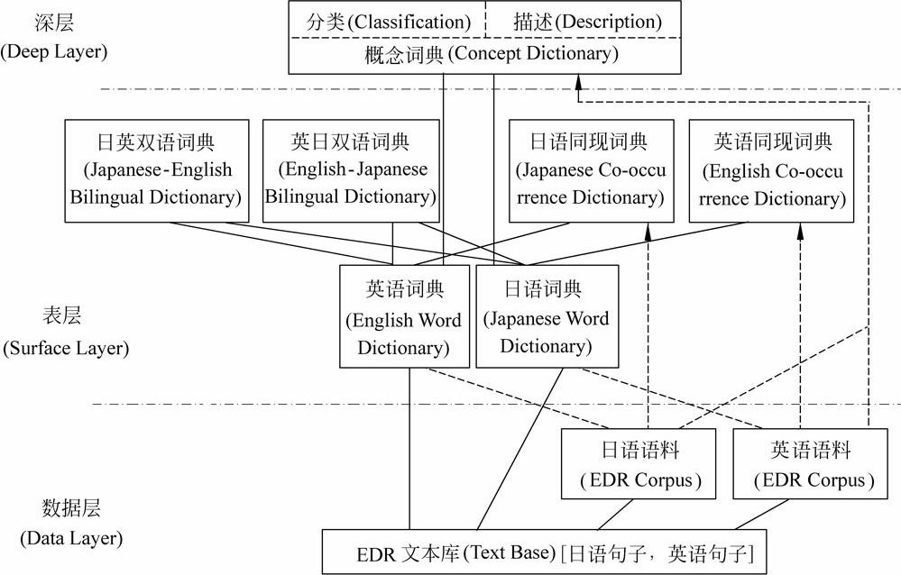
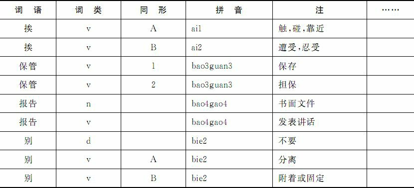
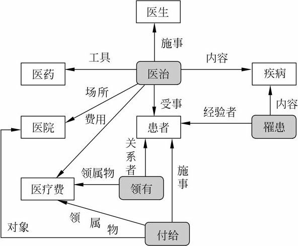
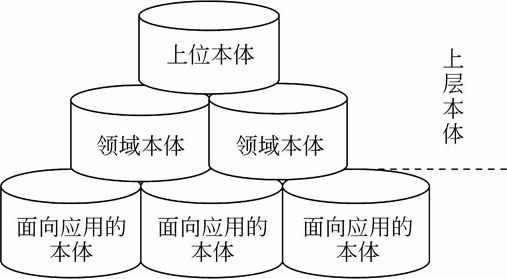
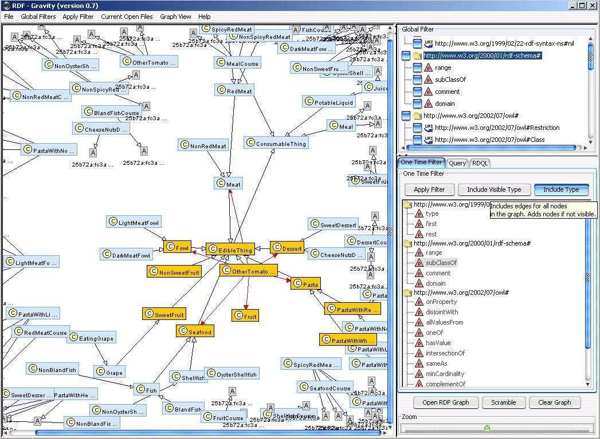

# 《统计自然语言处理》第4章 - 语料库与语言知识库

## 4.1 语料库技术
### 4.1.1 概述
- 语料库（corpus base）就是存放语言材料的数据库
- 语料库语言学（corpus linguistics）就是基于语料库进行语言学研究的一门学问
	- 研究自然语言机读文本（或称“电子文本”）的采集、存储、标注、检索、统计等方法的一门学问，其目的是通过对客观存在的大规模真实文本中的语言事实进行定量分析，为语言学研究或自然语言处理系统开发提供支持。

### 4.1.2 语料库语言学的发展
- 发展阶段
	1. 20世纪50年代中期以前：早期的语料库语言学
		- 语言习得、音系研究、方言学与语料库技术的结合
	2. 1957年至20世纪80年代初期：沉寂时期
		- chomsky否定早期语料研究：
			1. 语言运用是语言能力的外显，语料经验模式方向有误
			2. 语料永远不完整、不充分（如存在递归结构）
	3. 20世纪80年代至今：复苏与发展时期
		- 第二代语料库相继建成
		- 基于语料的研究项目大量增加
		- 复苏原因：
			1. 规则不能覆盖所有语言事实
			2. CS发展使语料库规模剧增

### 4.1.3 语料库的类型
- 语种：单语种、多语种
- 记载媒介：单媒体、多媒体
- 地域：国家、国际
- 平衡语料库与平行语料库
	- 平衡七项原则[张普, 2003]：语料的真实性、语料的可靠性、语料的科学性、语料的代表性、语料的权威性、语料的分布性和语料的流通性 
		- 其中，语料的分布性还要考虑语料的科学领域分布、地域分布、时间分布和语体分布等。
	- 平行语料库：
		1. 同一语言语料平行：语料选取的时间、对象、比例、文本数、文本长度等几乎是一致的
		2. 多语言平行采样加工 
- 用途
	- 通用语料库
	- 专用语料库
- 分布时间
	- 共时语料库
		- 共时研究：研究大树的横断面所见的细胞和细胞关系，即研究一个共时平面中的元素与元素的关系
	- 历时语料库
		- 历时研究：研究一个历时切面中元素与元素关系的演化
		- 判断历时语料库原则
			1. 是否动态：语料库必须是开放的、动态的；
			2. 本是否具有量化的流通度属性：所有的语料都应来源于大众传媒， 具有与传媒特色相应的流通度属性。 其量化的属性值也是动态的；
			3. 深加工是否基于动态的加工方法：随语料的动态变化采集， 并进行动态地加工；
			4. 是否取得动态的加工结果：语料的加工结果也应是动态的和历时的。
- 加工程度
	- 生语料
	- 标注语料库
		- 具有词性标注
		- 句法结构信息标注（树库）
		- 语义信息标注

### 4.1.4 汉语语料库建设中的问题
1. 语料库建设的规范问题
2. 产权保护和国家语料库建设问题

### 4.1.5 典型语料库介绍
1. LDC中文树库（Chinese Tree Bank, CTB）

- 在CTB中，汉语词性被划分为33类
	- 包括4类动词和谓语性形容词（Verb, Adjective，分别记作： VC, VE, VV, VA）
	- 3类名词（Noun，分别记作：NR, NT, NN）
	- 1类处所词（Localizer，记作：LC）
	- 1类代词（Pronoun, PN）
	- 3类限定词和数词（Determiner and Number，分别记作：DT, CD, OD）
	- 1类量词（Measure word，记作：M）
	- 1类副词（Adverb，记作：AD）
	- 1类介词（Preposition，记作：P）
	- 2类连词（Conjunction，分别记作：CC,CS）
	- 8类语气词（Particle，分别记作：DEC, DEG, DER, DEV, SP, AS, ETC, MSP）
	- 8类包括外来词、标点、感叹词等在内的其他词类（分别记作：IJ, ON, PU, JJ, FW, LB, SB,BA）
- CTB包括23类句法标记（syntactic tag）
	- 17类短语：形容词短语（adjective phrase, ADJP）、副词开头的副词短语（adverbial phrase headed by AD, ADVP）、量词短语（classifier phrase, CLP）、补语性嵌套句的从属连词引起的分句（clause headed by complementizer, CP）、XP＋DEG结构构成的短语（DNP）、限定词短语（determinerphrase,DP）、XP＋DEV结构构成的短语（DVP）、片段语（fragment,FRAG）、简单分句（simple clause headed by INFL, IP）、XP＋LC结构构成的短语（LCP）、用于解释说明性的列表标记短语（listmarker,LST）、名词短语（noun phrase, NP）、介词短语（preposition, PP）、插入语（parenthetical, PRN）、数量词短语（quantifier phrase, QP）、非一致性并列短语（unidentical coordination phrase, UCP）和动词短语（verb phrase, VP）
	- 6个动词复合形式的标记（VCD, VCP,VNV, VPT, VRD, VSB）
	- 一些句法结构成分标记，如：主语（-SBJ）、谓语（-PRD）、宾语（-OBJ）等。

2. 命题库（PropBank）、名词化树库（NomBank）和语篇树库（Penn Discourse Tree Bank, PDTB）
	- PropBank的目标是对原树库中的句法结点标注上特定的论元标记（argument label） ， 使其保持语义角色的相似性
	- NomBank标注的是树库中名词的词义和相关的论元信息。
	- 目标是开发一个标注语篇结构信息的大规模语料库， 主要标注与语篇连通方式（discourse connectives） 相关的一致关系（coherence relation）
3. 布拉格依存树库（Prague Dependency Treebank, PDT）
	- PDT包含三个层次：
		1. 形态层(morphological layer)：PDT的最低层， 包含全部的形态信息标注；
		2. 分析层(analytic layer)：PDT的中间层， 主要是依次关系中的表层句法信息标注， 层次概念上接近于Penn Treebank中的句法标注；
		3. 深层语法层(tectogrammatical layer)：PDT的最高层， 表达句子的深层语法结构。
4. BTEC口语语料
	- 其目标是开展语音翻译的国际合作研究， 开发实用的语音翻译技术。
5. 现代汉语口语语料库
6. 台湾中研院语料库
- LDC语音数据库

## 4.2 语言知识库
- 语言知识库：词汇知识库、句法规则库，还是语法信息库、语义概念库
- “语言知识库”比“语料库”包含更广泛的内容
	1. 一类是词典、规则库、语义概念库等，其中的语言知识表示是显性的，可采用形式化结构描述
	2. 另一类语言知识存在于语料库之中，每个语言单位的出现，其范畴、意义、用法都是确定的

### 4.2.1 WordNet
- 英语机读词汇知识库
- WordNet的建立有三个基本前提：
	1. “可分离性假设（separability hypothesis）”，即语言的词汇成分可以被离析出来并专门针对它加以研究。 
	2. “模式假设（patterning hypothesis）”：一个人不可能掌握他运用一种语言所需的所有词汇，除非他能够利用词义中存在的系统的模式和词义之间的关系。 
	3. “广泛性假设（comprehensiveness hypothesis）”：计算语言学如果希望能像人那样处理自然语言，就需要像人那样储存尽可能多的词汇知识［Miller et al.,1993］。
- WordNet是一个按语义关系网络组织的巨大词库，多种词汇关系和语义关系被用来表示词汇知识的组织方式。词形式（word form）和词义（word meaning）是WordNet源文件中可见的两个基本构件，词形式以规范的词形表示，词义以同义词集合（synset）表示。词汇关系是两个词形式之间的关系，而语义关系是两个词义之间的关系。

### 4.2.2 FrameNet
- FrameNet是基于框架语义学（frame semantics）并以语料库为基础建立的在线英语词汇资源库，其目的是通过样本句子的计算机辅助标注和标注结果的自动表格化显示，来验证每个词在每种语义下语义和句法结合的可能性（配价，valence）范围

### 4.2.3 EDR
- EDR电子词典（EDR Electronic Dictionary）是由日本电子词典研究院（Japan Electronic Dictionary Research Institute, Ltd.）开发的面向自然语言处理的词典。该词典由11个子词典（sub-dictionary）组成，包括概念词典、词典和双语词典等。

### 4.2.4 北京大学综合型语言知识（CLKB）
- 现代汉语语法信息词典（grammatical knowledge base, GKB），含8万词的360万项语法属性描述；
	- 
- 汉语短语结构规则库，含600多条语法规则；
- 现代汉语多级加工语料库（word-sense tagging corpus, STC），实现词语切分并标注词类的基本标注语料库1.5亿字，其中精加工的有5200万字，标注义项的有2800万字；
- 多语言概念词典，含10万个以同义词集表示的概念；
- 平行语料库，含对译的英汉句对100万；
- 多领域术语库，有35万汉英对照术语。

### 4.2.5 知网（HowNet）
- 知网（HowNet）是机器翻译专家董振东和董强经过十多年的艰苦努力创建的语言知识库，是一个以汉语和英语的词语所代表的概念为描述对象，以揭示概念与概念之间以及概念所具有的属性之间的关系为基本内容的常识知识库。
	- 
- 知网是一个知识系统，而不是一部语义词典。知网用概念与概念之间的关系以及概念的属性与属性之间的关系形成一个网状的知识系统，这是它与其他树状词汇数据库的本质不同。
- **义原（Sememes）**：原子语义，最基本的、不易于再分割其意义的最小单位

### 4.2.6 概念层次网络（Hierarchical Network of Concepts, HNC）
- 概念层次网络（Hierarchical Network of Concepts, HNC）是中国科学院声学研究所黄曾阳建立的面向整个自然语言理解的理论框架
- 局部联想脉络是HNC理论的基本内容之一，它由五元组、语义网络和概念组合结构组成，它是计算机把握并理解语言概念的基本前提，其基本思路和做法是：把概念分为抽象概念和具体概念，对抽象概念用语义网络和五元组来表达，对具体概念采取挂靠展开近似表达的方法。
- 在HNC理论中，五元组、语义网络和概念组合结构用来表达抽象概念。五元组是指{动态、静态、属性、值、效应}五大特性，它们是词性的基元，用以表达概念的外在表现。
- 三大语义网络
	- 基本概念语义网络
	- 基元概念语义网络
	- 逻辑概念语义网络

## 4.3 语言知识库与本体论
### 本体概念
- 本体论（ontology）：关于“onto”的“logos”，即研究一切有关“存在”（希腊文onto是“存在、有、是”的意思，英文译为being）的学问或理念（logos）。
> 本体论补充
> - 即“是什么”，连接主词与谓词的系词问题
> - 我们应该如何把握抽象的对象？
> - 巴门尼德：如果我们对主词一无所知，那么它的所有规定性都来自于它的谓词。
>	- 世界的本源是不生不灭的、单一的、完美无缺的。
> - 亚里士多德：不断追溯更高的属并找到种差就可以定义万事万物，但上溯到最终会发现有一件事物无法定义，没有更高的属，也不存在种差，即being（存在）
> 	- 后人将亚里士多德使用系词结构“X是什么”对事物下定义，不可避免地遇到的一系列本质问题，成为形而上学（metaphysics）

- 计算机科学领域中，本体（Ontology）是共享概念模型明确的形式化规范说明。
- 本体定义的四层含义
	- 概念模型（Conceptualization）：通过抽象出客观世界中一些现象的相关概念而得到的模型，其表示的含义独立于具体的环境状态。
	- 明确（Explicit）：所使用的概念及使用这些概念的约束都有明确定义。
	- 形式化（Formal）：本体是计算机可读的，即计算机可处理。
	- 共享（Share）：共同认可的知识，反映相关领域中公认的概念集，它所针对的是团体而非个体。
- 本体的目标：捕获相关领域的知识
- 语义网（Semantic Web）：希望构建一个通用本体，提供一种计算机能够理解的、结构化的语义描述机制，及一系列推理规则以实现自动化推理。语义网将不仅仅为人类更能为计算机带来语义内容，使计算机能够“理解”Web内容，进而实现信息处理的自动化。
- 为什么用本体？
	- > 在万维网中，我们可能会用不同的术语来表达相同的含义，或者一个术语含有多个含义。因此，消除术语差异是很有必要的。目前我们的解决方案就是，对某个领域建立一个公共的本体。鼓励大家在涉及该领域的时候都使用公共本体里的术语和规则。

- 知识复用问题
- 概念化（conceptualization）是知识形式化表达的基础，是所关心领
域中的对象、概念和其他实体，以及它们之间的关系
	- T.R.Gruber: An ontology is an explicit specification of a conceptualization.
- 每一个知识库、基于知识库的信息系统以及基于知识共享的智能agent都内含一个概念化的世界，或是显式的，或是隐式的。而本体论是对某一概念化所作的一种显式解释说明。本体论中的对象以及它们之间的关系是通过知识表达语言的词汇来描述的。因此，可以通过定义一套知识表达的专门术语来定义一个本体，以人可以理解的术语描述领域世界的实体、对象、关系以及过程等，并通过形式化的公理来限制和规范这些术语的解释和使用。
- 本体就是一个描述特定领域概念的知识库，其内容不仅包括领域的主要概念，还包括它们之间的关系。面向不同应用的系统都可以利用本体所提供的领域知识完成特定的任务，例如事件信息抽取，信息检索等。
- 本体是语言相关的，而概念化则是语言无关的。概念化是比本体论（仅限于信息科学中）更为广泛的概念，前者更接近领域的事实和哲学上的本体论
- 本体的核心概念是知识共享，通过减少概念和术语上的歧义，建立一个统一的框架或规范模型，使得来自不同背景、持不同观点和目的的人员之间的理解和交流，以及不同系统之间的互操作或数据传输成为可能，并保持语义上的一致。
- 在一个领域中，本体构成了该领域任意知识表达系统的核心

### 本体的构建
- 方式：自顶向下、自底向上
- 自动本体构建
	1. 第一部分用于确定领域中的概念集合
	2. 第二部分是关系发现（relationship discovery），用以识别和提取概念之间的关系。
- 核心领域本体是对领域中的核心概念进行建模。
- 本体构建与语言知识库建设密切联系
	- 一方面，本体理论对于语言知识库的建设具有一定的借鉴意义。
	- 另一方面，本体的构建过程又离不开自然语言处理技术。
- 本体语言：XML、XML Schema、RDF、RDF Schema、OWL
- 本体可视化：
