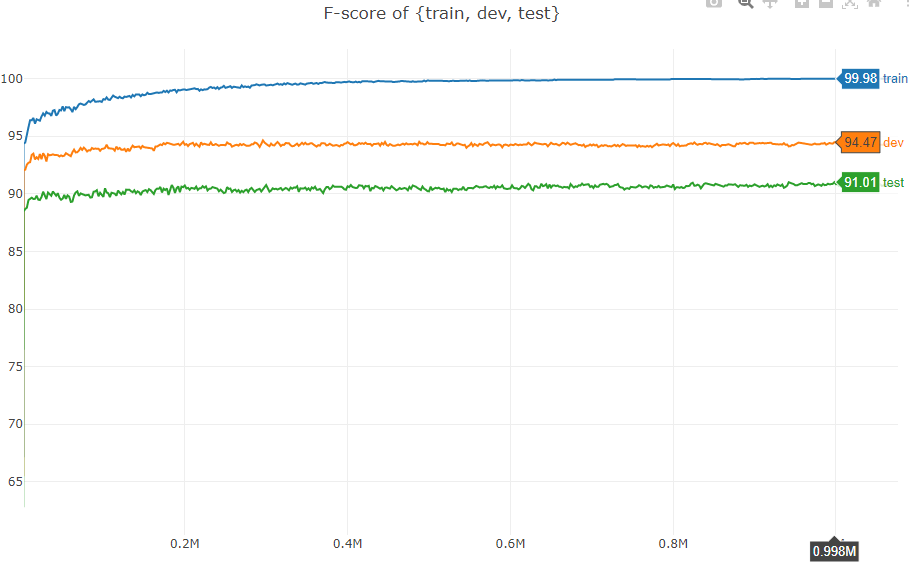

# 基于PyTorch实现BiLSTM-CRF-NER模型及其改进

PyTorch implementation of **BiLSTM-CRF** and **Bi-LSTM-CNN-CRF** models for named entity recognition.

> GitHub: https://github.com/ZubinGou/NER-BiLSTM-CRF-PyTorch

## Requirements
- Python 3
- PyTorch 1.x

## Papers
- Bidirectional LSTM-CRF Models for Sequence Tagging (Huang et al., 2015)
  - the first paper apply BiLSTM-CRF to NER
- Neural Architectures for Named Entity Recognition (Lample et al., 2016)
  - introducing character-level features: pre-trained word embedding（skip-n-gram）with character-based word embeddings trained by RNN
  > F1: 90.94 in CoNLL 2003 (English) & 91.47 in CoNLL++
- End-to-end Sequence Labeling via Bi-directional LSTM-CNNs-CRF (Ma et al., 2016)
  - character-level information trained by CNNs
  > F1: 91.21 in CoNLL 2003 (English) & 91.87 in CoNLL++
- A Deep Neural Network Model for the Task of Named Entity Recognition （Le et al., 2018)
  - capitalization features
  > F1: 91.22 in CoNLL 2003 (English)

## Dataset
- CoNLL 2003 (English)

### Evaluation
- conlleval: Perl script used to calculate FB1 (**phrase level**)

## Model
- Embeddings
  - 100d pre-trained word embedding with Glove
  - 25d charactor embedding trained by CNNs (Ma et al., 2016)
- BiLSTM-CRF (Lample et. al., 2016)

## Results
Trained with Tesla T4 for for one night (70 epochs), obtain 91.01% F1.

<!--  -->



## Future Works
- Next papers：
  - BiLSTM-CRF+ELMo ((Peters et al., 2018)
  - LM-LSTM-CRF (Liu et al., 2018)
  - Flair
  - ...
- 中文 NER
- Batch training

## References
- https://pytorch.org/tutorials/beginner/nlp/advanced_tutorial.html
- https://github.com/ZhixiuYe/NER-pytorch
